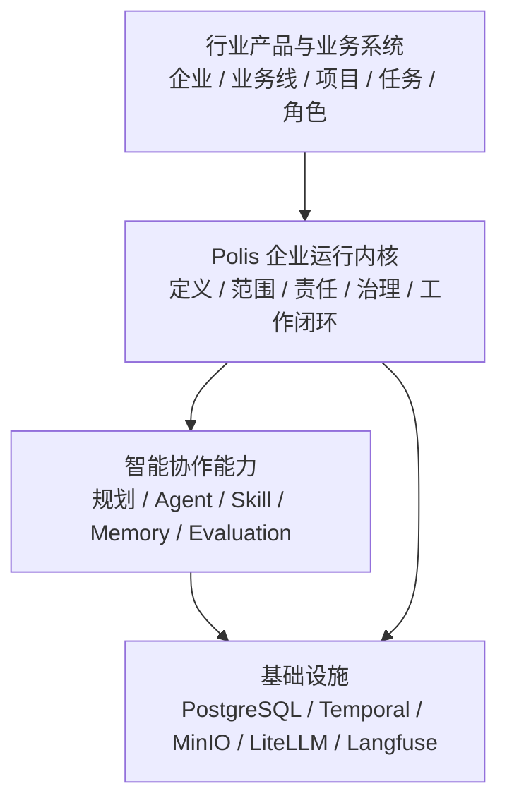

# Polis · 可持续运行的虚拟智能企业平台

> **一句话介绍**：Polis 把企业的业务规则、责任角色、工作执行、结果评价和后续行动组织成一个可持续运行、可恢复、可审计的人机协作系统。

Polis 的目标不是生成一个“看起来像企业”的组织外壳，也不只是把通用任务拆给多个 Agent。它希望成为
虚拟企业的运行基础：企业、业务线、项目、任务和角色可以按行业定义；人、Agent 与系统服务在明确责任
和权限内共同工作；每次执行都有输入、计划、结果、评价和可追溯的下一步。

品牌隐喻来自城邦：每个组织（Org）都是一个自治单元，有成员和 Agent、角色分工、治理规则、工作过程、
记忆与资产沉淀。

## 这是什么 / 不是什么

Polis 是：

- 一套面向企业真实工作的运行基础，用统一协议承载不同企业和行业的业务对象、责任关系与工作闭环；
- 一个让人、Agent 和系统服务在明确责任与权限下共同工作的智能协作平台；
- 一个允许自然语言和模型提出候选方案、但由定义、权限、审批和验收规则决定真实业务变化的受控系统；
- 一个复用成熟基础设施、可以连接企业既有数据和业务系统的开放平台。

Polis 不是：

- 根据一句经营理念就自动发布真实业务线、项目和 Agent 的“一键企业生成器”；
- 只做任务分解、Agent 管理或传统项目看板的通用工具；
- 要求成熟企业重建全部组织和历史数据的替代式系统；
- 从零自研数据库、工作流引擎、模型网关、向量库或可观测平台的基础设施项目。

## 项目整体结构

从用户视角，企业、业务线、项目、任务和角色始终以行业熟悉的语言出现；内部由稳定运行协议连接
Agent 能力，产品不要求普通用户理解底层元数据。



这四层的职责不同：

| 层次 | 负责什么 | 不负责什么 |
|---|---|---|
| 行业产品与业务系统 | 用户术语、页面、表单、客户交互和外部系统接入 | 不直接决定底层执行一致性 |
| 企业运行内核 | 定义版本、责任权限、状态变化、执行闭环、审计和恢复 | 不硬编码某个行业的“企业/项目”模型 |
| 智能能力 | 规划、能力路由、Agent 执行、记忆、评价和工具调用 | 不绕过内核直接改变业务事实 |
| 基础设施 | 数据持久化、长流程编排、对象存储、模型和观测 | 不成为企业业务状态的唯一真相源 |

## Polis 如何工作

1. **描述业务环境**：用企业熟悉的对象表达组织、业务线、项目、客户、订单或其他行业实体。
2. **建立责任关系**：定义角色的职责、权限、协作关系和作用范围，再把具体人员、Agent 或服务安排到岗。
3. **承接真实工作**：工作绑定明确的业务范围、输入、验收标准和责任人，而不是只保存一段自然语言目标。
4. **组织协同执行**：系统生成或选择执行计划，在责任边界内路由 Agent、Skill、工具和人工参与者。
5. **评价结果并继续运行**：结果经过规则、模型或人工评价，形成完成、返工、人审或失败等明确结论。
6. **用事件连接后续行动**：评价和业务事件转化为下一项工作，让企业运行形成可追溯、可恢复的闭环。

## 核心能力

- **业务结构承载**：支持按行业描述企业、业务线、项目及其关系，并连接 CRM、ERP 等权威数据来源。
- **责任与角色组织**：区分业务责任、执行委派和能力要求，让角色不仅是名称，也具备治理与协同含义。
- **人机协同执行**：统一组织人员、Agent、Skill、工具和系统服务，共同完成短任务与长流程。
- **工作全生命周期**：覆盖输入、规划、执行、结果、评价、返工、人审、完成和后续工作触发。
- **治理与安全**：提供权限交集、组织政策、精确审批、凭证隔离、多租户隔离和完整审计。
- **记忆与资产沉淀**：让工作上下文、事实、产物和经验在明确范围内积累、检索和复用。
- **可靠运行与恢复**：支持幂等、重试、并发控制、故障恢复和长时间运行，不因单次中断丢失业务状态。
- **可观测与可解释**：可以追踪工作由谁发起、为何流转、使用了哪些能力、产生了什么结果和成本。

## 核心原则

1. **企业运行优先于企业外观**：成功标准是工作能够持续推进、评价、返工和恢复，不是自动生成多少对象。
2. **业务语义由行业定义**：企业、业务线、项目、客户或订单不是内核硬编码表；行业包和适配器决定其含义。
3. **责任先于能力路由**：先确定谁对工作负责，再在允许的人员、Agent 或服务中选择执行者。
4. **模型提出候选，系统决定生效**：自然语言可辅助创建方案，但状态变化必须经过权限、策略、审批和校验。
5. **数据库保存业务事实**：Temporal 负责编排和恢复，PostgreSQL 保存可查询、可审计的业务状态。
6. **尊重企业既有系统**：通过引用、适配和受控同步接入既有组织与业务数据，不要求企业从零重建。
7. **对普通用户屏蔽内核抽象**：产品使用工作、负责人、进度、结果和待办等业务语言，不直接暴露系统内部协议对象。

## 技术栈

| 层 | 技术 |
|---|---|
| 后端 | Python 3.12, FastAPI, SQLAlchemy 2.0 async, Pydantic v2, Alembic, uv |
| 前端 | Next.js 14 App Router, React 18, TypeScript, pnpm |
| 编排 | Temporal Python SDK |
| 模型 | LiteLLM, DeepSeek, 本地 TEI embedding |
| 数据 | PostgreSQL, pgvector, Alembic migrations |
| 对象存储 | MinIO / S3 兼容 |
| 可观测 | Langfuse + Polis 自建观测 API/UI |
| 工具/技能 | MCP 抽象、Skill loader、内置工具与可扩展技能 |

## 目录结构

```text
polis/
├─ backend/        FastAPI modular monolith
│  ├─ src/polis/
│  │  ├─ api/      health/catalog 等聚合路由
│  │  ├─ core/     安全等基础能力
│  │  ├─ db/       session、RLS/org scoped 助手、ORM 基础
│  │  └─ modules/  org/planner/runtime/memory/model/observability/storage
│  ├─ migrations/  Alembic 迁移
│  └─ tests/       pytest 集成与单元测试
├─ frontend/       Next.js Web 工作台
│  ├─ app/         登录、工作台、Org 子页面
│  ├─ components/  应用壳与通用组件
│  └─ lib/         API client
├─ infra/          docker-compose 本地基础设施
└─ docs/           设计、约束、ADR、研发计划、技术债与续接指南
```

## 快速开始

后端、前端和基础设施分开启动。第一次启动前请复制环境变量模板并按本机情况填充密钥。

```bash
# 1. 基础设施：PostgreSQL/pgvector
cd infra
cp -n .env.example .env
docker compose up -d postgres

# 2. 后端
cd ../backend
cp -n .env.example .env
make install
make migrate
make seed
make dev

# 3. 前端
cd ../frontend
pnpm install
pnpm dev
```

常用地址：

- 后端 API：`http://localhost:8000`
- OpenAPI/Swagger：`http://localhost:8000/docs`
- 前端：`http://localhost:3000`

涉及真实任务执行时，还需要 Temporal worker、模型服务和按需基础设施：

```bash
# Temporal + UI
cd infra
docker compose --env-file .env up -d temporal temporal-ui

# Polis worker
cd ../backend
make worker

# 按需：MinIO / Langfuse / LiteLLM / text-embeddings
cd ../infra
docker compose --env-file .env up -d minio langfuse litellm text-embeddings
```

也可以用 compose profile 启动整栈容器：

```bash
cd infra
cp -n .env.example .env
docker compose --env-file .env --profile app up -d
```

更多环境细节、测试账号、DeepSeek/TEI/Langfuse 注意事项见 [docs/续接指南.md](docs/续接指南.md)。

## 常用命令

本地质量门禁：

```bash
uv tool install pre-commit
scripts/install-gitleaks.sh
pre-commit install -t pre-commit -t commit-msg -t pre-push
```

后端：

```bash
cd backend
make dev            # uvicorn 热重载服务，端口 8000
make worker         # Temporal worker
make migrate        # Alembic upgrade head
make seed           # 幂等 seed 能力/模型/预设/模板
make lint           # ruff check
make type           # mypy strict
make test           # pytest
make check          # lint + type + test

# 真实模型专项门：固定 judge 回归集（需配置 DeepSeek Key）
uv run python scripts/eval/judge_regression_gate.py --json-out var/eval/judge.json
# 本机代理导致模型连接失败时，追加 --disable-proxy 直连
```

前端：

```bash
cd frontend
pnpm dev            # Next.js dev server
pnpm build          # 生产构建
pnpm start          # 启动生产构建
```

## 架构入口

- 应用组合根：[backend/src/polis/main.py](backend/src/polis/main.py)
- API 聚合：[backend/src/polis/api/router.py](backend/src/polis/api/router.py)
- 后端配置：[backend/src/polis/config.py](backend/src/polis/config.py)
- 前端 API client：[frontend/lib/api.ts](frontend/lib/api.ts)
- 本地基础设施：[infra/docker-compose.yml](infra/docker-compose.yml)

后端采用 modular monolith，常见分层为 `api -> application/service -> domain/repository`。组织级业务由
`X-Org-Id`、成员校验、Repository 过滤和数据库 RLS 共同保证隔离；Temporal 负责编排，PostgreSQL 保存
业务事实，Agent 和外部系统通过受控适配器参与运行。

## 文档导航

- [docs/README.md](docs/README.md)：完整文档索引。
- [docs/design/](docs/design/)：产品、系统与数据设计。
- [docs/constraints/](docs/constraints/)：UI、前端、后端、移动端、工程化与过程约束。
- [docs/decisions/](docs/decisions/)：ADR 架构决策。
- [docs/plan/](docs/plan/)：研发计划与任务清单。
- [docs/tech-debt.md](docs/tech-debt.md)：技术债台账。

## 贡献约定

工程操作契约见 [CLAUDE.md](CLAUDE.md)。核心原则：

- 改动前读相关设计与约束，优先遵循现有模块边界和代码风格。
- 迁移只走 Alembic，密钥只走环境变量，`.env` 不入库。
- 多租户相关改动必须考虑 `org_id`、`X-Org-Id`、RLS 与隔离回归。
- 提交前至少按风险运行对应测试；较大改动应跑 `cd backend && make check` 等价门禁。
