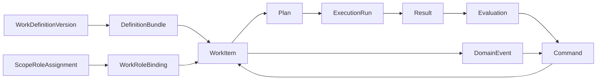

# 00 内核总纲与边界

## 1. 目标

第三轮内核的目标不是模拟企业的外观，而是提供一套能够承载多种企业经营方式的稳定运行协议：

> 将可版本化的领域规则编译为不可变的运行定义，让人、Agent 和系统服务在明确责任与权限内，
> 通过可审计命令推动工作，经执行、结果和评价形成闭环，并能够在中断、重试和升级后恢复。

内核成功的标准不是“自动生成了多少业务对象”，而是：

1. 同一份定义在固定输入下能得到可解释、可追溯的运行路径；
2. 任何状态变化都知道由谁、基于什么权限、从哪个命令触发；
3. 工作在失败、返工、人审和系统重启后仍可继续；
4. 新行业只需添加定义和适配器，不需修改命令、事件、治理和执行主链；
5. 现有 Task/Plan/TaskRun 能渐进迁移，不发生一次性重写。

## 2. 内核边界

### 2.1 内核固定的内容

内核只固定下列概念和协议：

- 定义版本：领域包、工作定义、角色定义；
- 编译快照：`DefinitionBundle`；
- 运行范围：`Scope`；
- 工作实例：`WorkItem`；
- 范围关系：`ScopeRelation`；
- 责任分配：`ScopeRoleAssignment`、`WorkRoleBinding`；
- 输入与产物：`Artifact`、`WorkSnapshot`；
- 决策：`Command`、`PolicyDecision`、`Approval`；
- 执行：`Plan`、`ExecutionRun`、`RunManifest`、`ExecutionReservation`、`ExternalEffectReceipt`；
- 输出与质量：`Result`、`Evaluation`；
- 连接：`DomainEvent`、`Trigger`、`OutboxMessage`、`ScheduledCommand`；
- 通用能力：幂等、并发控制、审计、租户隔离、恢复和版本固定。

### 2.2 由领域包决定的内容

以下内容不是内核常量：

- 企业、业务线、项目、客户、订单等业务对象名称；
- 对象字段、业务校验和对象间关系；
- 各类工作的业务状态和阶段门；
- 角色名称、职责、能力要求和协作关系；
- 哪些事件创建哪些工作；
- 输入、结果、验收和评价的业务 Schema；
- 行业政策、风险分类和默认审批规则。

这些内容统一由 `DomainPackageVersion`、`WorkDefinitionVersion` 和
`RoleDefinitionVersion` 提供。产品层把企业、业务线和项目映射为特定 `scope_type`，
内核不为它们创建硬编码分支。

### 2.3 由上层产品决定的内容

- 用户看到哪些页面、表单和术语；
- 哪些定义允许业务用户配置；
- 哪些对象来自 CRM、ERP 或其他权威系统；
- 行业包的安装、购买和运营方式；
- 自然语言如何转换为候选工作；
- 人机交互与服务交付流程。

内核 API 是面向适配器与开发者的协议，不等同于最终用户信息架构。

本轮不设计最终产品形态，但必须维持当前页面和 API 的业务连续性。内核达到 K5/K6 稳定门后，
产品层必须重新完成用户故事、信息架构、页面状态和新旧流程迁移设计；具体约束见
[09 渐进演化与产品连续性](09-渐进演化与产品连续性.md)。

## 3. 中心主轴



主轴中最重要的约束是：

- `WorkItem` 创建时固定一个 `DefinitionBundle`，运行中不得静默漂移；
- `ScopeRoleAssignment` 决定谁在范围内承担责任，`WorkRoleBinding` 将有效任职绑定到工作槽位；
- `Evaluation` 只给出标准结果，不直接改 `WorkItem`；
- 所有状态变化都必须转换为 `Command`；
- 事务完成后产生 `DomainEvent`，后续动作由触发器转换为新命令。

## 4. 十六条内核不变量

以下条款使用“必须”表示实现和测试的强制要求。

### K-I01 单一状态写入口

`WorkItem.lifecycle_state` 和 `execution_status` 必须只由内核 Command Handler 修改。
API、Temporal Activity、Evaluator、Trigger 和适配器不得直接更新状态列。

### K-I02 定义不可变

已发布的三个 DefinitionVersion 与 DefinitionBundle 必须不可修改。修订必须创建新版本。
运行中的 WorkItem 永远读取自身固定的 bundle。

### K-I03 数据库是真相源

PostgreSQL 中的 WorkItem、Transition、ExecutionRun、Approval 和 Event 是业务真相。
Temporal 保存执行历史并负责等待、重试和恢复，但不得成为唯一业务状态来源。

### K-I04 命令至少一次，效果至多一次

命令和事件允许被重复投递；相同 `org_id + idempotency_key` 只能产生一次业务效果。
数据库业务效果至多一次。外部 provider 支持幂等键时必须传递同一键；不支持时不得盲重试，歧义结果
必须进入 `ExternalEffectReceipt.status=uncertain` 并等待对账/人工处置。不得用本地账本声称外部 exactly-once。

### K-I05 先授权后执行

每个会改变业务状态或产生副作用的命令必须经过固定顺序：

```text
身份校验 → 任职范围 → 内核硬策略 → 领域策略 → 状态机守卫 → 审批凭证
```

任何层返回拒绝，后续层不得放宽。

### K-I06 评价与变化解耦

Evaluator 只能写 `Evaluation` 并发布事件。把 `pass/rework/human_review/fail`
转成状态变化的是 Trigger + Command Handler。

### K-I07 责任先于能力路由

执行节点必须先解析角色槽位和有效任职，再在被任职的执行者中按能力、健康、容量和成本路由。
禁止仅凭 `required_capabilities` 在全组织 Agent 中直接选择。

### K-I08 所有异步消息可追溯

Command、Event、Run 和外部调用必须携带 `correlation_id`、`causation_id` 与其家族的定义固定字段：
Definition 使用具体 definition version，Scope 使用 domain package version，Work/Run 使用
`definition_bundle_id`；敏感内容只传 Artifact 引用，不复制明文。

### K-I09 租户隔离双保险

所有组织运行态表必须带 `org_id`，Repository 显式过滤并启用 RLS。公开定义资产只允许按
`public 或 owner_org_id=current_org` 读取，写入仍严格限属主。

### K-I10 元数据不执行任意代码

状态守卫、触发条件和策略只能使用 [11](11-声明式协议与运行安全闭合.md) 的 SchemaProfileV1、
ConditionExprV1、MappingExprV1 与 RFC 6901 PathV1。定义 JSON 中不得嵌入 Python、
JavaScript、SQL、模板表达式求值或任意网络调用。

### K-I11 Command 家族显式分离

Definition、Scope、Work 写操作必须分别使用 `DefinitionCommandEnvelope`、`ScopeCommandEnvelope`、
`WorkCommandEnvelope` 和各自 handler。只共享固定 `CommandHeader`，不得增加
`aggregate_type + aggregate_id` 通用信封或含大量可空目标字段的公共写入口。

### K-I12 子工作定义依赖固定

`create_child_work` 只能使用父 `DefinitionBundle` 编译时固定的 child dependency bundle。运行时不得
按 key 查询最新 published 定义；依赖缺失或已被禁用于新实例时确定性拒绝，不猜测替代版本。

### K-I13 责任与执行分离

范围责任和工作槽位绑定必须分别持久化；每个需要问责的 Plan 节点都必须存在 accountable binding。
执行可委派给 human/agent/service，但不得让能力路由或执行者身份隐式成为责任人。

### K-I14 长时意图必须持久化

等待审批、未来时间、外部恢复或重试的命令必须在 `CommandReceipt` 或 `ScheduledCommand` 中保存可恢复
的类型化意图和校验摘要。进程内 timer、日志、Temporal history 或客户端重发都不能成为唯一来源。

### K-I15 组织政策必须有唯一治理 Scope

每个进入内核的组织必须且只能有一个 `scope_type=org_governance` 的非归档 Scope，并由
`org_kernel_setting.governance_scope_id` 唯一指向。组织政策只存放在该 Scope 的
`attributes.kernel_policy`；policy revision 固定为 Scope version，policy checksum 固定为该值对象的
JCS checksum。不得把同一组织政策复制到 Settings、DomainPackage 或执行配置中形成第二事实源。

### K-I16 核心运行模型必须由 kernel 单点声明

`Plan`、`TaskRun/ExecutionRun`、`RunManifest`、`Approval`、`ResultEnvelope` 和 `ArtifactDescriptor` 的
SQLAlchemy 声明必须且只能存在于 `kernel.models`。旧模块在迁移期只允许重新导出同一个 class object，
不得声明同名/同表 ORM 模型；数据库表名、数据和兼容 API 不因代码所有权迁移而改变。

## 5. 双层状态模型

企业工作经常同时存在“业务阶段”和“系统执行状态”。将两者塞进一个枚举会导致状态爆炸，因此
WorkItem 使用两个正交字段：

| 维度 | 来源 | 例子 | 谁能改变 |
|---|---|---|---|
| `lifecycle_state` | WorkDefinition 的状态机 | `draft/reviewed/accepted` | Command Handler |
| `execution_status` | 内核固定枚举 | `idle/queued/running/waiting/evaluating/succeeded/failed/cancelled` | Command Handler |

`lifecycle_state` 表达业务含义；`execution_status` 表达当前是否有执行以及执行到哪里。一个
`lifecycle_state=reviewing` 的工作可以处于 `waiting`，也可以在补充材料后重新处于 `running`。

状态机转换可以声明对执行层的 effect，例如 `request_plan` 或 `start_run`，但 effect 通过
Outbox 异步执行，状态事务不直接调用 Temporal。

“正交”只表示两者含义独立，不表示任意组合合法。合法组合、命令转换和 `active_run_id` 规则由
[02 §5](02-命令事件与状态闭环.md) 的固定矩阵决定；数据库 check 与 domain test 必须使用同一枚举源。

## 6. 模块结构与依赖方向

第三轮仍保持模块化单体，不拆微服务。模块结构固定为：

```text
backend/src/polis/modules/kernel/
├── api.py                 # HTTP 适配器；只调 application
├── schemas.py             # Pydantic 输入/输出与消息信封
├── errors.py              # 稳定错误码
├── application/
│   ├── command_service.py # 仅共享 receipt/策略/事件事务设施，不接收通用信封
│   ├── definition_commands.py # DefinitionCommandService
│   ├── scope_commands.py      # ScopeCommandService
│   ├── work_commands.py       # WorkCommandService
│   ├── definition_validator.py # 纯验证，不持久化
│   ├── definition_compiler.py  # 纯编译，不持久化
│   ├── query_service.py
│   └── reconciliation.py
├── domain/
│   ├── state_machine.py   # 纯函数
│   ├── policy.py          # 纯策略组合
│   ├── triggers.py        # 纯匹配与循环保护
│   └── outcomes.py
├── repository.py          # 唯一 DB 访问层
├── models.py              # SQLAlchemy 模型
├── outbox.py              # 投递与幂等消费
└── temporal_adapter.py    # Temporal SDK 适配；按 workflow type 字符串启动，不 import 旧模块
```

依赖必须保持：

```text
api / temporal_adapter / outbox worker
              ↓
        application
          ↓       ↓
       domain   repository
```

`domain` 不得 import FastAPI、SQLAlchemy、Temporal、LiteLLM 或 MCP。现有 planner/runtime/
observability 通过适配器调用 kernel application，不反向依赖 kernel API。

`temporal_adapter` 只依赖 kernel application port、Temporal SDK 和配置中的 workflow type/queue 字符串；
不得 import `planner.workflow` 或 `runtime`。现有 Worker 可 import kernel Activity/application。由此 Temporal
仍是 kernel 的外部执行适配器，不形成 kernel → legacy 的反向依赖。

### 6.1 物理模型所有权与兼容导入

以下所有权是实现约束，不是目录建议：

| SQLAlchemy class | 唯一声明位置 | 迁移期兼容位置 |
|---|---|---|
| `Plan`、`TaskRun` | `polis.modules.kernel.models` | `planner.models` 仅 alias/re-export |
| `RunManifest`、`Approval` | `polis.modules.kernel.models` | `observability.models` 仅 alias/re-export |
| `ResultEnvelope`、`ArtifactDescriptor` | `polis.modules.kernel.models` | `memory.models` 仅 alias/re-export |

`polis.db.models` 必须显式 import `kernel.models` 一次完成 Alembic 注册；旧模块只注册仍由自身拥有的模型。
`kernel.models` 不得 import planner/runtime/memory/observability 的 models、service 或 repository；跨表关系使用
本模块 class 或字符串 FK。旧模块可依赖 kernel，kernel 不得反向依赖旧模块。兼容 alias 的移除只能在
K6 之后由单独清理 ADR 决定。

## 7. 现有实现映射

| 当前对象 | 第三轮语义 | 实施策略 |
|---|---|---|
| `Task` | 旧工作模板/入口 | 保留；适配创建 WorkItem，后续降为兼容层 |
| `Plan` | 某次执行的计划快照 | 保留；增加 WorkItem 与 bundle 关联 |
| `TaskRun` | `ExecutionRun` 的现有物理实现 | 保留表名；增加 WorkItem、bundle 和幂等字段 |
| `Role`/`RoleTemplate` | 组织角色实例/旧角色资产 | 映射到 RoleDefinitionVersion/ScopeRoleAssignment，不原地改变语义 |
| `Agent`/`AgentVersion` | 执行者及固定版本 | 继续复用，通过 ScopeRoleAssignment 任职与 WorkRoleBinding 委派 |
| `ResultEnvelope` | 节点级 Result | 增加 WorkItem、Run 与 Schema 信息 |
| `ArtifactDescriptor` | Artifact | 增加 WorkItem 引用，停止用 `meta.owner_task_id` 表达归属 |
| `Approval` | 旧通用审批记录 | 增加 command fingerprint、有效期与 WorkItem 关联 |
| `RunManifest` | 执行可复现快照 | 增加 DefinitionBundle、assignment 与 context snapshot |
| `Memory` | 受范围控制的上下文来源 | 保留；读取必须经 WorkItem/WorkRoleBinding 范围解析 |
| `TaskWorkflow` | 执行编排器 | 保留；通过 Activity 读写内核，不直接决定业务终态 |

## 8. 完成判定

稳定内核第一阶段完成，必须同时满足：

- A–R 一致性样例均可经三类显式 Command Handler 与共享基础设施完整运行；
- 定义版本发布后不可修改，WorkItem 可重现其 bundle；
- 非法转换、越权命令、过期审批和重复命令均被确定性拒绝；
- 执行成功、返工、人审和失败四条评价路径都能闭环；
- PostgreSQL 已提交而 Temporal 启动失败时，Outbox 可恢复启动；
- Temporal 已完成但回写中断时，对账器可恢复数据库状态；
- A/B 组织互不可见，公开定义只读可见；
- 旧 Task API 在迁移窗口内继续通过现有回归测试。
- 10 章 G1–G6 通过，未决业务/架构选择为 0，任一能力可从验收用例唯一追溯到实现合同。
- 11 章协议与 `protocol-manifest.yaml` 一致，外部副作用歧义和 Artifact 部分提交均有可恢复终态。
