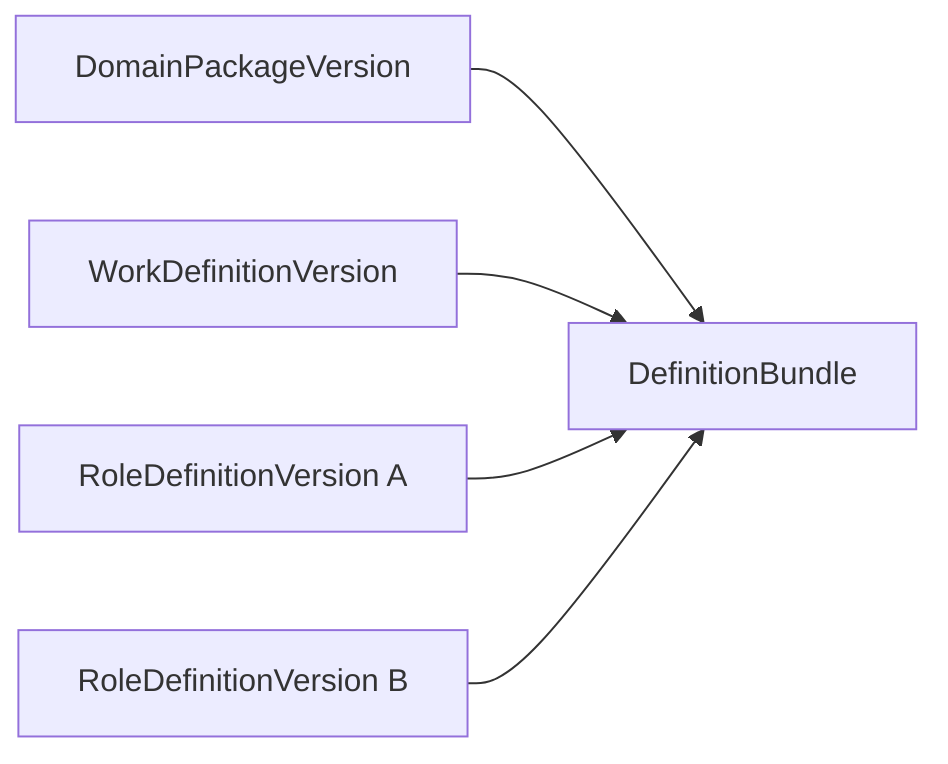
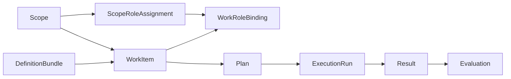
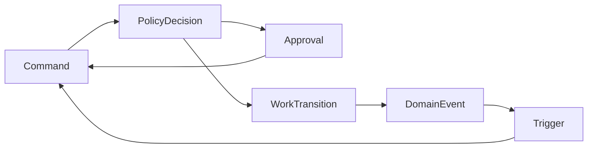

# 01 元模型与关系

## 1. 建模规则

本章把对象分为三类，避免“所有配置都是一个顶级元模型”：

1. **定义态**：可创作、校验、发布和版本化；
2. **编译态**：把一次运行需要的定义版本固定为不可变快照；
3. **运行态**：工作、任职、计划、执行、结果和事件。

首版只有三个可独立发布的定义聚合根。状态机、Schema、策略、评价和触发规则均为它们的内嵌
值对象，不独立建“模板管理中心”。

## 2. 总体关系

### 2.1 定义与编译



### 2.2 运行主链



### 2.3 控制与连接



## 3. 三个定义聚合根

所有定义版本共有以下字段：

| 字段 | 类型 | 约束 |
|---|---|---|
| `id` | UUID | 版本记录主键 |
| `key` | string | 稳定机器标识，`lower_snake_case` 或点分命名 |
| `version` | semver string | `MAJOR.MINOR.PATCH` |
| `owner_org_id` | UUID/null | null 表示平台资产，否则为组织私有资产 |
| `visibility` | enum | `public/private` |
| `status` | enum | `draft/published/deprecated` |
| `schema_version` | integer | 定义 JSON 本身的结构版本，首版为 1 |
| `revision` | integer | draft 乐观锁，初始 1，每次 draft 更新 +1；发布后固定 |
| `definition` | JSONB | 经对应 Pydantic 模型验证后的规范内容 |
| `checksum` | string | 规范化 JSON 的 SHA-256 |
| `created_by` | UUID/null | 平台 seed 可为空 |
| `created_at/published_at` | TIMESTAMPTZ | 发布时间仅 published 有值 |

约束：

- `published` 后禁止 UPDATE `definition/key/version/owner_org_id`；
- `deprecated` 只阻止创建新 bundle，不影响已固定的 WorkItem；
- `visibility=public` 只允许平台发布流程创建，组织用户不能把私有资产直接改成 public；
- 对同一 owner 范围，`key + version` 唯一；
- checksum 严格使用 11 §2 的 RFC 8785 JCS + SHA-256 小写十六进制，不允许组件自定义序列化。
- `definition` JSON 必须包含 12 §7 的 `definition_kind`，与物理表、Command kind 交叉校验并参与 checksum；
  01 章旧示例若未展示该字段，仅作历史结构说明，不是可发布 fixture。

### 3.1 DomainPackageVersion

DomainPackageVersion 描述一个领域可使用哪些范围类型、关系和默认规则。它不保存具体企业或项目。

`definition` 结构：

```json
{
  "schema_version": 1,
  "key": "core.generic",
  "display_name": "通用领域包",
  "scope_types": [
    {
      "key": "workspace",
      "parent_types": [],
      "attributes_schema": {
        "type": "object",
        "additionalProperties": true
      }
    },
    {
      "key": "work_group",
      "parent_types": ["workspace"],
      "attributes_schema": {
        "type": "object",
        "additionalProperties": true
      }
    }
  ],
  "relationship_types": [
    {
      "key": "participates_in",
      "from_scope_types": ["work_group"],
      "to_scope_types": ["work_group"],
      "cardinality": "many_to_many",
      "directed": true,
      "attributes_schema": {"type": "object", "additionalProperties": false}
    }
  ],
  "policy_defaults": {
    "unknown_action": "deny",
    "dangerous_action": "require_approval"
  },
  "compatible_work_definition_keys": ["core.document_review"],
  "compatible_role_definition_keys": ["core.owner", "core.reviewer"]
}
```

内核只校验 scope 类型、父子关系和 Schema；`workspace` 在产品中是否显示为企业由适配器决定。

`relationship_types` 由运行态 `ScopeRelation` 实例化。关系必须属于同一 org、使用同一个
DomainPackageVersion，并满足 from/to 类型、方向、cardinality 和 attributes schema。父子树只表达
包含关系；参与、服务、依赖等非树关系必须使用 ScopeRelation，不得塞入 `Scope.attributes`。

### 3.2 RoleDefinitionVersion

RoleDefinitionVersion 定义责任席位，而不是 Agent persona 或职称。

```json
{
  "schema_version": 1,
  "key": "core.reviewer",
  "display_name": "复核责任人",
  "mission": "对指定工作结果作独立复核",
  "accountabilities": [
    "确认输出符合验收规则",
    "发现证据不足时要求返工"
  ],
  "required_capabilities": ["review.quality_check"],
  "authority": {
    "commands": ["submit_for_review", "request_rework", "decide_work_approval"],
    "tools": [],
    "data_scopes": ["work.inputs", "work.results"],
    "max_risk_level": "medium",
    "budget_cents": 0
  },
  "collaboration": {
    "receives_from": ["producer"],
    "hands_off_to": ["owner"],
    "escalates_to": ["owner"]
  },
  "quality_bar": {
    "evaluation_rule_keys": ["review_completeness"]
  },
  "capacity": {
    "max_active_work_items": 10
  }
}
```

角色定义不绑定具体人或 Agent。具体承担者由 ScopeRoleAssignment 确定，具体工作由 WorkRoleBinding
绑定。AgentVersion 中的工具权限只是
执行者自身上限，实际权限是多层交集，见 03。

### 3.3 WorkDefinitionVersion

WorkDefinitionVersion 是中心定义，描述一种工作如何接收输入、流转、执行和验收。

下列 JSON 是 presentation-only 的结构说明，`state_machine/planning_profile/execution_profile/
evaluation_rules/triggers` 省略了完整 fixture 内容；它不能直接通过 publish 校验。可发布 fixture 以 08 章
、12 章及 `backend/tests/fixtures/kernel` 为准。

```json
{
  "schema_version": 1,
  "key": "core.document_review",
  "display_name": "文档复核",
  "supported_scope_types": ["workspace", "work_group"],
  "input_schema": {
    "type": "object",
    "required": ["document_artifact_id"],
    "properties": {
      "document_artifact_id": {"type": "string", "format": "uuid"}
    },
    "additionalProperties": false
  },
  "result_schema": {
    "type": "object",
    "required": ["decision", "findings"],
    "properties": {
      "decision": {"enum": ["accept", "revise"]},
      "findings": {"type": "array", "items": {"type": "string"}}
    },
    "additionalProperties": false
  },
  "role_slots": [
    {
      "key": "owner",
      "role_definition_key": "core.owner",
      "required": true,
      "min_assignments": 1,
      "max_assignments": 1,
      "responsibility_kind": "accountable",
      "execution_policy": "delegation_allowed",
      "inheritance_mode": "nearest"
    },
    {
      "key": "reviewer",
      "role_definition_key": "core.reviewer",
      "required": true,
      "min_assignments": 1,
      "max_assignments": 2,
      "responsibility_kind": "reviewer",
      "execution_policy": "responsible_actor_only",
      "inheritance_mode": "nearest",
      "separation_of_duties_from": ["producer"]
    }
  ],
  "state_machine": {},
  "policy_bindings": [],
  "planning_profile": {},
  "execution_profile": {},
  "evaluation_rules": [],
  "human_review_reject_action": "rework",
  "child_dependencies": [],
  "triggers": []
}
```

下列内容必须内嵌：

| 值对象 | 作用 | 首版是否独立建表 |
|---|---|---|
| `input_schema/result_schema` | 输入输出验证 | 否 |
| `role_slots` | 本工作需要的责任席位 | 否 |
| `state_machine` | 业务状态与合法转换 | 否 |
| `policy_bindings` | 领域策略绑定 | 否 |
| `planning_profile` | 规划约束与 Plan Schema | 否 |
| `execution_profile` | 超时、重试、并发和执行器约束 | 否 |
| `evaluation_rules` | 规则、阈值和结果映射 | 否 |
| `triggers` | 事件到命令的声明式映射 | 否 |
| `child_dependencies` | 子工作 dependency key 与允许目标声明 | 否 |

RoleSlot 固定字段语义：

| 字段 | 枚举/含义 |
|---|---|
| `responsibility_kind` | `accountable/contributor/reviewer/observer` |
| `execution_policy` | `responsible_actor_only/delegation_allowed/autonomous` |
| `inheritance_mode` | `none/nearest/merge`；决定是否从父 Scope 解析任职 |

`accountable` slot 必须 `min_assignments >= 1`。`autonomous` 仍需一个 accountable slot 对最终结果负责；
它只表示本节点可由 Agent 自动执行，不表示取消责任链。

升级为顶级定义的必要条件：至少被三个 WorkDefinition 独立引用，存在独立发布/授权/废弃需求，并
能证明复制导致了实际不一致。满足条件后仍需 ADR。

## 4. DefinitionBundle

DefinitionBundle 是编译产物，不是第四个可创作元模型。其作用是把 WorkItem 所需版本固定下来。

字段：

| 字段 | 含义 |
|---|---|
| `id/org_id` | 组织内 bundle |
| `domain_package_version_id` | 唯一领域包版本 |
| `work_definition_version_id` | 唯一工作定义版本 |
| `role_definition_version_ids` | 通过关联表固定所有角色版本 |
| `compiled_definition` | 解析默认值与引用后的完整 JSON 快照 |
| `checksum` | 完整快照校验值 |
| `compiler_version` | 内核编译器版本 |
| `kernel_contract_version` | 本规格运行协议版本，当前 `3.4` |
| `min_kernel_version` | 运行该 bundle 的最低内核 semver |
| `child_work_bundle_dependencies` | dependency key → 固定 child bundle ID/checksum |
| `created_at` | 创建时间 |

编译步骤：

1. 确认所有定义为 `published`，且当前组织可见；
2. 校验 domain package 允许该工作和角色 key；
3. 解析 WorkDefinition 的每个 role slot 到唯一 RoleDefinitionVersion；
4. 按 11/12 章校验所有 SchemaProfileV1、ConditionExprV1、MappingExprV1、状态、策略、触发器和能力 key；
5. 检测状态机不可达状态、触发器明显自环和职责分离冲突；
6. 填充默认超时、重试、评价结果映射；
7. 校验 compile payload 的 `child_dependencies_by_key` 与 WorkDefinition 声明完全相等，递归编译/复用
   明确的子 bundle，以 `(domain version, work version)` 做 DFS 环检测，把 ID/checksum 写入 dependency
   closure；禁止 `latest`、版本范围和运行时 key 查找；
8. 校验 `kernel_contract_version/min_kernel_version` 与当前解释器兼容；
9. 生成 canonical JSON、checksum 和 bundle；
10. 若同一 org 已有相同 checksum，返回现有 bundle，保证编译幂等。

Bundle 不允许更新或删除。定义 deprecated 后 bundle 仍可读取；只有显式“升级工作定义”用例才能
为尚未开始的 WorkItem 创建新实例或克隆到新 bundle，禁止修改原 WorkItem 的 bundle_id。

## 5. 运行态对象

### 5.1 Scope

Scope 是数据、责任和工作的作用范围。

| 字段 | 说明 |
|---|---|
| `id/org_id` | 组织内唯一 |
| `scope_type` | 必须在所用 DomainPackageVersion 中声明 |
| `parent_scope_id` | 可空；父类型必须被领域包允许 |
| `external_ref` | 可空；连接上层产品或权威系统对象 |
| `display_name` | 内核调试和审计使用，不规定产品文案 |
| `attributes` | 按 scope type 的 Schema 校验 |
| `status` | `active/archived` |
| `version` | 乐观锁版本 |

Scope 不复制 CRM/ERP 业务数据。`external_ref` 只存稳定引用，业务快照通过 Artifact 或适配器读取。

#### 5.1.1 内置组织治理 Scope

平台必须 seed 一个 `key=kernel.governance`、`version=1.0.0`、`visibility=public`、`status=published` 的
DomainPackageVersion。它只声明保留类型 `org_governance`；其 attributes schema 固定为根对象只含
`kernel_policy`，该对象只在 DomainPackage 层要求 integer `schema_version` 并允许版本字段的稳定 envelope；
具体字段再由 kernel contract 中的 OrgPolicyV1
严格校验。未来 OrgPolicyV2 通过新 kernel contract/interpreter 增量支持，不要求替换 Scope 或修改已发布
DomainPackageVersion。任何其他 DomainPackage 不得声明该类型。每个
org 必须且只能创建一个 `org_governance` Scope，`parent_scope_id/external_ref` 必须为空，`display_name`
固定为 `Organization Governance`，该 Scope 不允许归档或替换。

该 Scope 的 `attributes` 必须严格匹配 `OrgPolicyV1`，不得有未声明字段：

```json
{
  "kernel_policy": {
    "schema_version": 1,
    "max_concurrent_runs": 20,
    "budget_limit_cents": 0,
    "budget_enforcement": "observe",
    "default_approval_ttl_seconds": 86400
  }
}
```

字段语义固定如下：

| 字段 | 约束与语义 |
|---|---|
| `schema_version` | 只允许 `1` |
| `max_concurrent_runs` | integer，1–10000；组织同时 held/running 的 Run 硬上限 |
| `budget_limit_cents` | integer，0–10^15；0 表示预算额度为 0，不表示无限 |
| `budget_enforcement` | `observe/deny/require_approval`；超额时分别放行并审计/拒绝/进入精确审批 |
| `default_approval_ttl_seconds` | integer，60–604800；既是缺省 TTL 也是组织上限，最终 TTL 取它、平台上限与所有匹配领域约束的最小值 |

组织政策 revision 记录该 Scope 当前 `version`（它是治理容器 revision，任职等治理变化也可使其增长）；
checksum 等于对 `attributes.kernel_policy` 执行 RFC 8785 JCS
后计算的 SHA-256。`update_scope` 是唯一政策修改入口；相同 policy checksum 是 no-op，不增长 version。
Plan、Run、Approval 和 Reservation 使用时必须保存 revision/checksum snapshot，不得在恢复时改读最新值。

平台同时 seed `key=kernel.governance_owner`、`version=1.0.0` 的 public RoleDefinitionVersion。其
`authority.commands` 必须恰为
`protocol-manifest.yaml` 3.4 中全部固定 Definition 与 Scope command discriminator，`data_scopes` 固定为
`kernel.definitions/kernel.scopes/kernel.governance`；未来新增命令必须发布新 RoleDefinitionVersion，不能
原地扩大 seed 权限。

### 5.2 WorkItem

WorkItem 是一次有状态工作的聚合根。

| 字段 | 说明 |
|---|---|
| `id/org_id` | 主键与租户 |
| `scope_id` | 工作发生的范围 |
| `parent_work_item_id` | 可空；只表达工作分解，不代替 Plan DAG |
| `definition_bundle_id` | 创建后不可变 |
| `lifecycle_state` | WorkDefinition 定义的业务状态 |
| `execution_status` | 内核固定执行状态 |
| `title` | 审计可读标题 |
| `inputs` | 通过 input_schema 校验后的轻量值与 Artifact 引用 |
| `priority` | 0–100 |
| `due_at` | 可空 |
| `created_by_kind/ref` | 创建者 |
| `version` | 每次成功命令 +1 |
| `input_revision` | 输入每次实际变化 +1，初始为 1 |
| `current_plan_id` | 可空；最近 ready/accepted 且未失效的 Plan |
| `active_run_id` | 可空；同一时刻至多一个活动执行 |
| `latest_evaluation_id` | 可空；最近一次已登记评价 |
| `kernel_mode` | `native/legacy_shadow`；创建后不可变 |
| `created_at/updated_at/closed_at` | 时间 |

WorkItem 保存当前快照，不采用全量 event sourcing。所有成功转换另写 append-only WorkTransition 和
DomainEvent，以支持审计、恢复和重放验证。

### 5.3 ScopeRoleAssignment 与 WorkRoleBinding

`ScopeRoleAssignment` 表示承担者在一个 Scope 内承担某个固定 RoleDefinition：

- `scope_id/role_definition_version_id/actor_kind/actor_ref`；
- `inheritance_mode=none/descendants`，只能进一步限制 slot 声明的继承；
- `authority_constraints` 只能缩小角色权限；
- `status=pending/active/suspended/ended`、有效期、分配者和 version。

`WorkRoleBinding` 表示具体 WorkItem 的角色槽位如何被满足：

- `work_item_id/role_slot_key`；
- `responsible_assignment_id`：必须指向当前 scope 或允许继承的 active ScopeRoleAssignment；
- `responsibility_kind_snapshot` 必须等于 bundle RoleSlot 的 `responsibility_kind`，只供审计和查询；
- `executor_kind/ref`：仅在 delegation_allowed/autonomous 时可填；为空表示责任承担者亲自执行；
- `delegated_by_binding_id`：委派时指向承担该槽位责任的 binding；
- `status=active/revoked/ended`、有效期、version。

同一 required slot 的 active binding 数必须满足 min/max。责任人变化必须显式 revoke/bind；范围任职
suspend 后既有 binding 立即失效，新命令/新 Run 不可使用，已运行 Run 按 04 的 Manifest 规则处理。
承担者可能是人、Agent 或系统服务。service 的 `actor_ref` 必须指向 `service_identity.id`，不接受自由
字符串；ActorResolver 统一校验实际生命周期。

### 5.4 Artifact 与 WorkSnapshot

Artifact 是所有大输入、产物和证据的统一描述符，正文仍在 MinIO：

- 归属 WorkItem，可选归属 ExecutionRun 和 Plan node；
- `kind=input/output/evidence/log/export`；
- `uri/mime/size/checksum`；
- `schema_ref`；
- `provenance` 包含创建者、来源 Artifact、Run、模型/工具引用；
- 对象 key 必须使用 `{org_id}/{work_item_id}/...` 新前缀。
- `status=staging/ready/quarantined/deleted`；Result、Snapshot、Evaluation 和 Context 只能引用 ready；上传、
  校验、提交与 orphan 回收严格按 11 §12。

WorkSnapshot 是规划、执行或评价实际读取内容的不可变索引：

- `phase=planning/execution/evaluation`；
- `work_item_id/run_id/work_role_binding_id`；
- `work_version/input_revision/input_checksum`；
- Artifact IDs、Memory IDs、外部快照 refs；
- 每项 checksum、截断策略、选择原因；
- `created_at`。

它不复制密钥、凭证和不必要的正文。

### 5.5 Plan、ExecutionRun、Result、Evaluation

- `Plan`：某个 WorkItem 在某个 bundle 与 planning WorkSnapshot 下生成的执行图快照；节点必须声明
  `role_slot_key`，并保存 source work/input revision；
- `ExecutionRun`：一次 Plan 执行；物理上首期继续使用 `task_run`；
- `RunManifest`：固定 AgentVersion、SkillVersion、模型、WorkRoleBinding、WorkSnapshot、Plan、bundle、
  policy/interpreter 版本；
- `Result`：节点级或工作级结构化输出，必须通过 result schema 或 node result schema；
- `Evaluation`：针对 Result 的不可变评价记录，输出标准 outcome；
- 同一个 Result 可有多次评价，但同一 `rule_set_version + attempt` 唯一。

标准评价 outcome 只有：

```text
pass | rework | human_review | fail
```

业务细分结论放在 `detail`，不得扩展内核枚举。

### 5.6 Command、Transition、Event 与 Schedule

- Command 是三类显式意图信封，可来自人、Agent、Temporal、Trigger 或系统维护任务；
- CommandReceipt 保存幂等处理、等待审批和恢复所需的类型化 payload 引用；
- WorkTransition 保存状态前后、命令和策略决策；
- DomainEvent 保存已发生事实；
- OutboxMessage 保存待投递事件；
- Trigger 是 WorkDefinition 内嵌规则，把 Event 转换为新 Command。
- ScheduledCommand 保存未来派发的确定信封模板、时区、错过策略和去重键；调度器只派发 Command。

### 5.7 运行安全记录

- `ExternalEffectReceipt`：固定一次逻辑外部调用的请求摘要、provider 幂等能力和
  `prepared/in_flight/succeeded/failed/uncertain` 状态；
- `ExecutionReservation`：在 start_work 事务内持久化 actor capacity 与 budget 占用，Run 终态释放；
- 两者是运行态协议对象，不可独立发布、不可由行业包扩展状态，完整协议见 11 §11/§13。

## 6. 基数与删除规则

| 关系 | 基数 | 删除规则 |
|---|---|---|
| DomainPackageVersion → DefinitionBundle | 1:N | RESTRICT |
| WorkDefinitionVersion → DefinitionBundle | 1:N | RESTRICT |
| RoleDefinitionVersion → Bundle | M:N | RESTRICT |
| DefinitionBundle → WorkItem | 1:N | RESTRICT |
| Scope → child Scope | 1:N | RESTRICT；先 archive |
| Scope → ScopeRelation | 1:N（两端） | 先 unrelate 或 archive relation |
| Scope → WorkItem | 1:N | RESTRICT |
| WorkItem → child WorkItem | 1:N | RESTRICT |
| Scope → ScopeRoleAssignment | 1:N | 历史保留 |
| WorkItem → WorkRoleBinding | 1:N | 历史保留 |
| WorkItem → Plan | 1:N | 历史保留 |
| Plan → ExecutionRun | 1:N | 历史保留 |
| Run → Result | 1:N | CASCADE 仅限测试清理；生产保留策略控制 |
| Run → ExternalEffectReceipt | 1:N | 历史保留；uncertain 不得自动删除 |
| Run → ExecutionReservation | 1:N | 历史保留；终态必须 released/expired |
| Result → Evaluation | 1:N | RESTRICT |
| WorkItem → Transition/Event | 1:N | 永不业务删除 |

生产 API 不提供物理删除 WorkItem、Transition、Event、Approval、Result 或 Evaluation。用户撤销用
`cancel/archive` 命令；法定删除由独立数据治理流程处理并留下 tombstone 审计。

## 7. 定义发布校验

发布必须一次性通过：

- JSON Schema 只允许 11 §3 的 SchemaProfileV1；未列 keyword 一律拒绝；
- 路径、条件、映射与 checksum 只允许 11 §2–§6 的唯一语法；
- `$ref` 只允许当前 definition 内 `#/$defs/` 引用，禁止远程、文件、动态和递归引用；
- 所有 key 格式合法且引用可解析；
- 初始状态唯一，至少有一个终态；
- 除明确标记的等待态外，所有非终态可到达终态；
- transition command key 在工作定义内唯一；
- 领域 command_type 不得占用 02 §2.1/2.2 的 Definition/Scope 目录或 Work 固定命令；全系统 discriminator
  在且只在一个 family；
- effect 只来自内核白名单；
- trigger condition 只来自安全操作符；
- role slot 的最小/最大人数合法；
- 职责分离图无自冲突；
- evaluation outcome 四种映射完整；
- 支持 human_review 时必须声明 `human_review_reject_action=rework/fail`，且目标 transition 唯一；
- timeout、retry、rework、trigger depth 均不超过平台硬上限。

校验失败返回稳定路径，例如：

```json
{
  "path": "/state_machine/transitions/2/to",
  "code": "UNKNOWN_STATE",
  "message": "目标状态 accepted 未定义"
}
```
