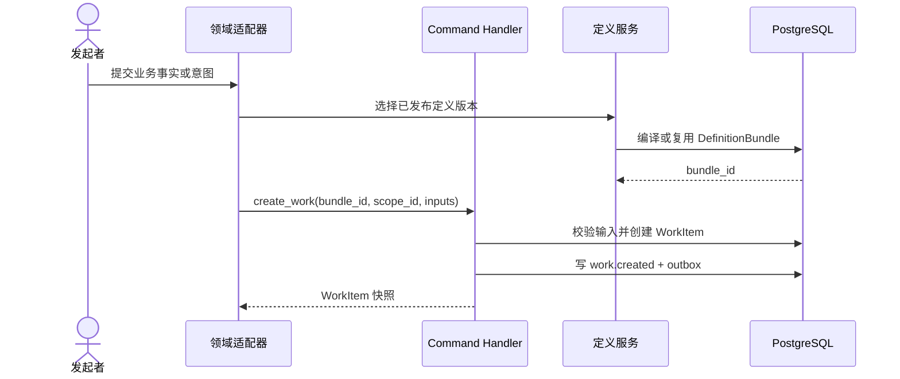
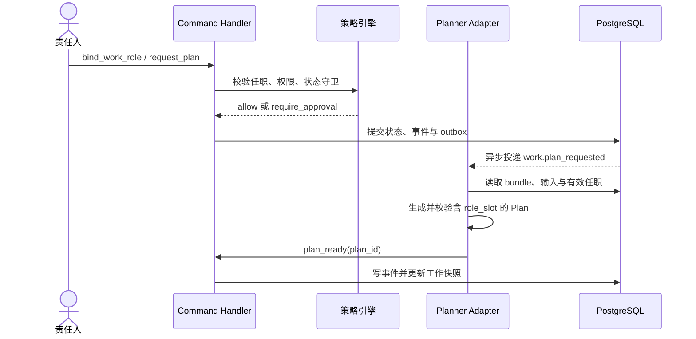
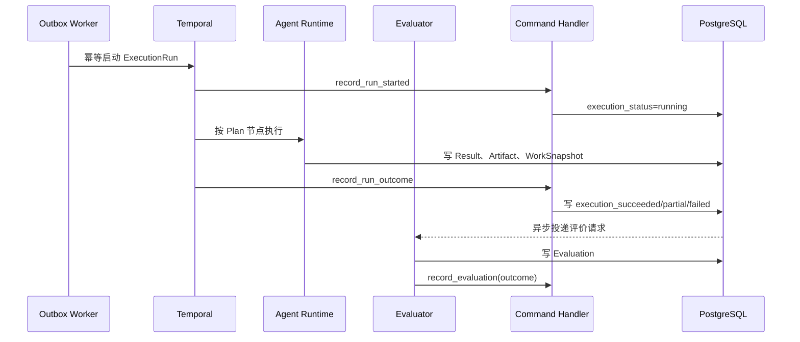
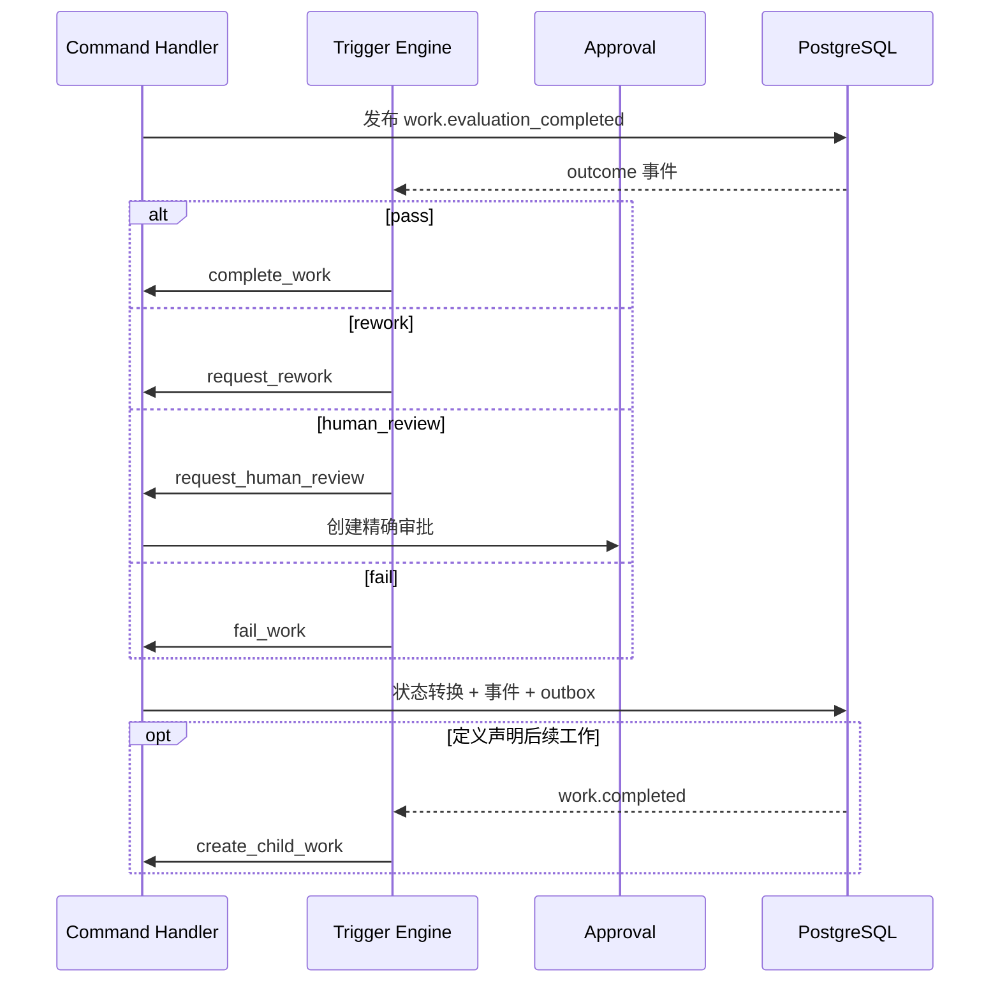

# 02 命令、事件与状态闭环

## 1. 通信方式

内核模块之间只允许四种通信载体：

1. **Command**：请求改变状态或产生动作；
2. **DomainEvent**：不可变的已发生事实；
3. **ArtifactRef**：传递大输入、结果与证据的引用；
4. **StandardOutcome**：Policy、Planner、Run、Evaluation 的有限结果集合。

模块不得通过共享可变 dict、直接改对方表或调用对方内部 Repository 进行协作。

## 2. Command 信封

Command 采用“共享头 + 三个显式家族”，不采用通用聚合信封。共享头 `CommandHeader` 固定为：

```json
{
  "command_id": "uuid",
  "schema_version": 1,
  "org_id": "uuid",
  "actor": {"kind": "human", "ref": "uuid"},
  "idempotency_key": "client-or-derived-key",
  "correlation_id": "uuid",
  "causation_id": "uuid-or-null",
  "requested_at": "2026-07-21T10:00:00Z"
}
```

共享约束：payload canonical JSON 最大 64 KiB；敏感值和大内容只传 Artifact/secret handle；外部 POST
必须提供 `Idempotency-Key`；Trigger 键固定为 `trigger:{trigger_key}:{event_id}:{target_ref}`；Temporal
键固定为 `run:{run_id}:{activity_key}:{logical_attempt}:{effect}`。actor 必须来自认证上下文，不能信任
公开请求 body。

以下三个信封 JSON 是 presentation-only：`header: {}` 明确代指上方完整 CommandHeader；实现 fixture 必须
展开全部必填头字段，不能接受空 header。

### 2.1 DefinitionCommandEnvelope

```json
{
  "family": "definition",
  "header": {},
  "command_type": "publish_work_definition",
  "definition_kind": "work",
  "definition_version_id": "uuid",
  "expected_definition_revision": 3,
  "payload": {}
}
```

- `definition_kind=domain_package/work/role`；
- HTTP/application adapter 在 T1 前为 create 预分配 `definition_version_id`，因此 ID 始终必填；create 的
  `expected_definition_revision=null`，其余命令 revision 必填；
- 锁对应 DefinitionVersion 行；compile 命令不锁 WorkItem，payload 显式携带所有版本 ID；
- 命令目录：`create_*_definition`、`update_*_definition_draft`、`publish_*_definition`、
  `deprecate_*_definition`、`compile_definition_bundle`、`decide_definition_approval`、
  `expire_definition_approval`、`revoke_definition_approval`；
- 只发布 `definition.*` 事件。validate 是 query，不是 Command。

### 2.2 ScopeCommandEnvelope

```json
{
  "family": "scope",
  "header": {},
  "command_type": "relate_scopes",
  "scope_id": "from-scope-uuid",
  "expected_scope_version": 4,
  "domain_package_version_id": "uuid",
  "payload": {"to_scope_id": "uuid", "relationship_type": "participates_in", "attributes": {}}
}
```

- adapter 在 T1 前为 create 预分配 `scope_id`，因此 ID 始终必填；create 的 expected version 为空；
  其余命令 version 必填；
- `scope_id` 始终是主锁；relate/unrelate 再按 UUID 升序锁另一端，禁止反序加锁；
- 命令目录：`create_scope`、`update_scope`、`archive_scope`、`relate_scopes`、`unrelate_scopes`、
  `assign_scope_role`、`activate_scope_role`、`suspend_scope_role`、`end_scope_role`、
  `cancel_scope_schedule`、`decide_scope_approval`、`expire_scope_approval`、`revoke_scope_approval`；
- 只发布 `scope.*` 事件。

### 2.3 WorkCommandEnvelope

```json
{
  "family": "work",
  "header": {},
  "command_type": "start_work",
  "work_item_id": "uuid",
  "expected_work_version": 4,
  "definition_bundle_id": "uuid",
  "payload": {}
}
```

- adapter 在 T1 前为 create 预分配 `work_item_id`，因此 ID 始终必填；create 的 expected version 为空；
  其余外部命令 version 必填；
- 内部恢复命令也必须携带创建 intent 时观察的 version；若过期则按具体命令的 stale rule 拒绝或对账，
  不允许跳过乐观锁；
- bundle 必须等于 WorkItem 固定值；
- 固定目录：`create_work`、`provide_input`、`bind_work_role`、`unbind_work_role`、
  `delegate_execution`、`revoke_delegation`、`request_plan`、`record_plan_ready`、`accept_plan`、
  `start_work`、`pause_work`、`resume_work`、`cancel_work`、`record_run_started`、`record_run_outcome`、
  `record_evaluation`、`request_rework`、`request_human_review`、`complete_work`、`fail_work`、
  `create_child_work`、`reconcile_work`、`cancel_work_schedule`、`decide_work_approval`、
  `expire_work_approval`、`revoke_work_approval`；
- WorkDefinition 可增加业务 transition command，但 discriminator 仍属于 Work family，且必须在 bundle
  编译时登记唯一 payload schema、from/to、policy 和 event mapping。

### 2.4 禁止的通用化

不得提供 `GenericCommandEnvelope`、`aggregate_type/aggregate_id`、任意 `target` JSON 或一个通过可空字段
猜测目标的 handler。三个 service 可共享 `CommandHeaderValidator`、`ReceiptRepository`、Policy、Audit、
Event/Outbox writer，但目标解析、锁、version 和 transition 代码必须分离并由类型检查覆盖。

### 2.5 Command payload 与结果目录

Definition family（`kind` 替换命令名中的 `*`，三类 schema 分别生成 discriminator）：

`*` 只允许展开为 `domain_package`、`work`、`role`；展开后的精确 discriminator 以
`protocol-manifest.yaml.command_families.definition.commands` 为闭集，不允许其他拼写。

| command_type | payload 必填字段 | 前置 | 成功事实 |
|---|---|---|---|
| `create_*_definition` | key, semver, visibility, definition | ID/key+version 不存在 | draft_created, revision=1 |
| `update_*_definition_draft` | definition | status=draft, revision match | draft_updated, revision+1 |
| `publish_*_definition` | 无 | draft、validate 全通过 | published；内容冻结 |
| `deprecate_*_definition` | reason_code | published | deprecated |
| `compile_definition_bundle` | domain_package_version_id, work_definition_version_id, role_versions_by_slot, child_dependencies_by_key | 全部 published/可见/兼容；依赖闭包按 11 §7 | bundle_compiled；同 checksum 返回既有 bundle |
| `decide_definition_approval` | approval_id,expected_approval_version,decision；reason_note 可空 | Approval/目标匹配；按 11 §8 | definition.approval_decided |
| `expire_definition_approval` | approval_id,expected_approval_version,reason_code | pending 且到期 | definition.approval_expired |
| `revoke_definition_approval` | approval_id,expected_approval_version,reason_code | pending/approved 且已失效 | definition.approval_revoked |

key、semver、owner 和 kind 创建后不可修改。compile envelope 的 target ID 必须等于
`work_definition_version_id`，expected revision 使用该 published WorkDefinition 的固定 revision。

Scope family：

| command_type | payload 必填字段 | 前置 | 成功事实 |
|---|---|---|---|
| `create_scope` | scope_type, display_name, attributes；parent/external 可空 | domain 声明类型，parent 合法 | scope.created version=1 |
| `update_scope` | `changes` 仅含 display_name/attributes | active, version match；结果 schema 合法 | scope.updated version+1；空变化 no_state_change |
| `archive_scope` | reason_code | 无 active child/work/relation/assignment | scope.archived |
| `relate_scopes` | to_scope_id, relationship_type, attributes | 两端 active、类型/基数合法 | scope.related；from scope version+1 |
| `unrelate_scopes` | relation_id, reason_code | active relation 且 scope_id 是规范 from | scope.unrelated；from scope version+1 |
| `assign_scope_role` | role_definition_version_id, actor_kind/ref, inheritance_mode, constraints, validity | role 可见、actor 有效、权限不扩大 | scope.role_assigned(pending) |
| `activate_scope_role` | assignment_id | pending、职责分离/容量/时间合法 | scope.role_activated |
| `suspend_scope_role` | assignment_id, reason_code | active | scope.role_suspended |
| `end_scope_role` | assignment_id, reason_code | pending/active/suspended | scope.role_ended |
| `cancel_scope_schedule` | schedule_id, reason_code | pending schedule 且 target scope 匹配 | scope.schedule_cancelled；scope version 不变 |
| `decide_scope_approval` | approval_id,expected_approval_version,decision；reason_note 可空 | Approval/目标匹配；按 11 §8 | scope.approval_decided |
| `expire_scope_approval` | approval_id,expected_approval_version,reason_code | pending 且到期 | scope.approval_expired |
| `revoke_scope_approval` | approval_id,expected_approval_version,reason_code | pending/approved 且已失效 | scope.approval_revoked |

Work family：

| command_type | payload 必填字段 | 前置/核心结果 |
|---|---|---|
| `create_work` | scope_id,title,inputs,priority；parent/due 可空 | bundle/scope/input 合法；work.created version=1 |
| `provide_input` | merge_patch (RFC 7396) | idle；合并后 schema 合法；checksum 变化才 revision/version+1 |
| `bind_work_role` | role_slot_key,responsible_assignment_id | slot/继承/min-max/SoD 合法；责任类型来自 slot；work.role_bound |
| `unbind_work_role` | binding_id,reason_code | active；不得使当前 active Run 失去 manifest 引用；work.role_unbound |
| `delegate_execution` | binding_id,executor_kind/ref | slot 允许且 actor/能力有效；work.role_delegated |
| `revoke_delegation` | binding_id,reason_code | active delegation；work.role_delegation_revoked |
| `request_plan` | 无 | idle、inputs/required slots 完整；work.plan_requested |
| `record_plan_ready` | plan_id,source_work_version,input_revision,input_checksum | 与当前 snapshot 一致；work.plan_ready |
| `accept_plan` | plan_id,plan_checksum | ready 且 source 仍一致；work.plan_accepted |
| `start_work` | plan_id | idle、accepted plan、无 active run；原子保留 capacity/budget 并创建 queued run |
| `pause_work` | reason_code | running；waiting + cancel-safe signal outbox |
| `resume_work` | 无 | waiting、assignment/policy 仍有效；running |
| `cancel_work` | reason_code | 非终态；cancelled + cancel outbox |
| `record_run_started` | run_id,temporal_workflow_id | queued 且 run 匹配；running |
| `record_run_outcome` | run_id,outcome,result_ids；失败/超时时 failure_code | run 必属该 Work；当前闭环 run 进入 evaluating；已提交 cancel intent 后的 cancelled 只归档诊断 |
| `record_evaluation` | evaluation_id,run_id,outcome | 当前 evaluating run/attempt；发 evaluation event |
| `request_rework` | evaluation_id | outcome=rework、未超上限；回业务 rework state/idle |
| `request_human_review` | evaluation_id | outcome=human_review；进入 review/waiting，并创建 purpose=quality_review、fingerprint 指向 complete_work 的待审批 receipt |
| `complete_work` | evaluation_id | outcome=pass；success lifecycle/succeeded |
| `fail_work` | evaluation_id 或 reason_code | outcome=fail 或不可恢复硬失败；failure lifecycle/failed |
| `create_child_work` | child_bundle_dependency_key,source_event_id,input_mapping；target_scope_id 可空 | dependency 固定、trigger receipt 唯一；scope 为空则继承父 scope，否则校验同 org/child 支持；child_created |
| `reconcile_work` | action,observed_external_ref,reason_code | service actor；action 仅限 04 §10 修复表；产生诊断/业务事件 |
| `cancel_work_schedule` | schedule_id,reason_code | pending schedule 且 target work 匹配；work.schedule_cancelled，Work version 不变 |
| `decide_work_approval` | approval_id,expected_approval_version,decision；reason_note 可空 | Approval/目标匹配；按 11 §8 | work.approval_decided |
| `expire_work_approval` | approval_id,expected_approval_version,reason_code | pending 且到期 | work.approval_expired |
| `revoke_work_approval` | approval_id,expected_approval_version,reason_code | pending/approved 且已失效 | work.approval_revoked |

payload 未列字段一律由 Pydantic `extra='forbid'` 拒绝。所有 reason_code 来自受控枚举；自由说明只能写
`reason_note`，最大 2 KiB 且不得进入 DomainEvent。只有 `update_scope` 空 changes、`provide_input` checksum
未变、`reconcile_work` 条件已自行收敛，以及 Run 已记录相同 outcome checksum 可返回
`no_state_change=true`；它们不写 transition/event，receipt
仍为 succeeded。其他命令不得把业务拒绝伪装成 no-op。

两个 cancel schedule 命令修改的是 ScheduledCommand 聚合：成功事件的 `aggregate_type=scheduled_command`、
`aggregate_id=schedule_id`、`aggregate_version=schedule.version`，但事件前缀沿用发出命令的 family；目标
Scope/Work 的 version 不增长。因此它们不是 no_state_change。

## 3. DomainEvent 信封

```json
{
  "event_id": "uuid",
  "event_type": "work.execution_succeeded",
  "schema_version": 1,
  "org_id": "uuid",
  "aggregate_type": "work_item",
  "aggregate_id": "uuid",
  "aggregate_version": 5,
  "event_sequence": 1,
  "event_count": 2,
  "domain_package_version_id": null,
  "work_definition_version_id": null,
  "role_definition_version_id": null,
  "definition_bundle_id": "uuid",
  "actor": {"kind": "service", "ref": "uuid"},
  "correlation_id": "uuid",
  "causation_id": "command-id",
  "payload": {
    "run_id": "uuid",
    "result_ids": ["uuid"]
  },
  "occurred_at": "2026-07-20T10:01:00Z"
}
```

规则：

- Event 使用过去式，表示事实，不使用 `please_*`；
- Event 在与聚合变更同一数据库事务中写入；
- `aggregate_version` 是变更后的目标聚合 version；同一命令产生 N 个事件时按确定目录顺序写
  `event_sequence=1..N/event_count=N`；
- Event 已提交后不可更新；业务纠正必须发对应 family Command，使聚合 version 增长并追加纠正事件；
- Definition event 按 kind 恰填 `domain_package_version_id/work_definition_version_id/
  role_definition_version_id` 之一；`scope.*` 填 `domain_package_version_id`，`work.*` 填
  `definition_bundle_id`；其余定义固定字段为 null，并由 check 约束保证；
- PII、密钥、长文本、prompt、结果正文不得进入 payload；
- Event schema 只允许向后兼容增加可选字段；破坏性变化提升 `schema_version`。

### 3.1 首版事件目录

| 事件 | 关键 payload |
|---|---|
| `work.created` | scope_id, initial_state |
| `work.input_provided` | artifact_ids, changed_fields |
| `work.role_bound` | binding_id, role_slot_key, responsible_assignment_id, executor_ref |
| `work.transitioned` | transition_key, from, to |
| `work.plan_requested` | plan_request_id |
| `work.plan_ready` | plan_id |
| `work.execution_requested` | run_id |
| `work.execution_started` | run_id, temporal_workflow_id |
| `work.execution_succeeded` | run_id, result_ids |
| `work.execution_partial` | run_id, result_ids, failed_node_ids |
| `work.execution_failed` | run_id, failure_class |
| `work.execution_timed_out` | run_id, failure_class |
| `work.run_outcome_archived` | run_id, outcome, superseded, result_ids |
| `work.evaluation_completed` | evaluation_id, outcome |
| `work.approval_requested` | approval_id, command_fingerprint |
| `work.approval_decided` | approval_id, decision |
| `work.human_review_requested` | evaluation_id, approval_id, review_command_receipt_id |
| `work.completed` | terminal_state |
| `work.failed` | terminal_state, reason_code |
| `work.cancelled` | reason_code |
| `work.child_created` | child_work_item_id |

非 Work 事件目录固定增加：

| 事件 | 关键 payload |
|---|---|
| `definition.draft_created/updated/published/deprecated` | definition_kind, definition_version_id, revision/checksum |
| `definition.bundle_compiled` | bundle_id, checksum, dependency checksums |
| `scope.created/updated/archived` | scope_id, scope_type, version |
| `scope.related/unrelated` | relation_id, relationship_type, from/to_scope_id |
| `scope.role_assigned/activated/suspended/ended` | assignment_id, role_definition_version_id, actor_ref |
| `work.role_bound/unbound/delegated/delegation_revoked` | binding_id, responsible/executor refs, role_slot_key |

任一 family 命令进入审批时发布 `{family}.approval_requested`，决定/消费发布
`{family}.approval_decided/expired/revoked/consumed`；Approval event 的 aggregate 是 Approval 自身，定义固定
字段沿用原命令 family。表中的 `work.approval_*` 是
Work family 实例，不表示 Definition/Scope 审批复用 Work event。

## 4. 标准结果

### 4.1 PolicyDecision

```text
allow | deny | require_approval
```

Decision 包含 `reason_codes[]`、匹配的 policy keys、所需 role slot 和审批有效期。多个策略组合使用
`deny > require_approval > allow`。

### 4.2 PlannerOutcome

```text
plan_ready | need_input | cannot_plan
```

- `plan_ready` 必须附 Plan ID 与校验摘要；
- `need_input` 必须列缺失字段/Artifact；
- `cannot_plan` 必须给稳定原因码，不自动伪造执行路径。

### 4.3 RunOutcome

```text
succeeded | partial | failed | cancelled | timed_out
```

`partial` 只表示执行层部分产出，不等于业务可接受；必须进入 Evaluation。

`failure_class` 是固定枚举：

```text
business_error | dependency_error | timeout | platform_safety | unexpected_cancel | infrastructure_error | unknown
```

`failure_code` 是对应 adapter 的受控稳定码；自由异常正文只能进入受限 log Artifact，不进入 Event。

### 4.4 EvaluationOutcome

```text
pass | rework | human_review | fail
```

Evaluator 必须保存规则版本、断言结果、模型 judge 信息和证据引用。模型分数本身不能直接改变状态。

## 5. 状态机定义

WorkDefinition 中的状态机结构：

> 下列片段只展示状态转换形态；Effect 的逐类型 payload、Profile、EvaluationRule 和 Trigger 完整结构以
> 12 §5 为准，不能把本片段当作完整 Definition fixture。

```json
{
  "initial_state": "draft",
  "states": [
    {"key": "draft", "terminal": false, "category": "open"},
    {"key": "reviewing", "terminal": false, "category": "active"},
    {"key": "accepted", "terminal": true, "category": "success"},
    {"key": "rejected", "terminal": true, "category": "failure"},
    {"key": "cancelled", "terminal": true, "category": "cancelled"}
  ],
  "transitions": [
    {
      "key": "submit",
      "command_type": "submit_for_review",
      "from": ["draft"],
      "to": "reviewing",
      "required_role_slots": ["owner"],
      "guards": [
        {"op": "input_exists", "path": "/work/inputs/document_artifact_id"}
      ],
      "policy_keys": ["standard_submit"],
      "effects": [
        {"type": "request_plan"}
      ]
    }
  ]
}
```

### 5.1 固定执行状态机与合法组合

执行状态只允许：

```text
idle → queued → running ↔ waiting → evaluating → succeeded
                   └──────────────→ failed
queued/running/waiting/evaluating → cancelled
```

| 命令/事实 | 前置 execution_status | 后置 | active_run_id |
|---|---|---|---|
| `request_plan/record_plan_ready/accept_plan/provide_input` | idle | idle | 必须 null |
| `start_work` | idle | queued | 设为同事务新建的 queued Run |
| `record_run_started` | queued | running | 保持且必须匹配 run_id |
| `pause_work` | running | waiting | 保持 |
| `resume_work` | waiting | running | 保持 |
| `record_run_outcome(succeeded/partial/failed/timed_out)` | running/waiting | evaluating | 保持至评价完成 |
| `record_run_outcome(cancelled)` | Work 已 cancelled | cancelled（不改变 Work） | 必须 null；Run version+1、只归档诊断 |
| `record_run_outcome(cancelled, failure_class=unexpected_cancel)` | running/waiting | evaluating | 保持至评价完成 |
| `record_evaluation(any outcome)` | evaluating | evaluating | 保持；只固定 latest_evaluation_id 并发布事实 |
| `complete_work` | evaluating | succeeded | 清空；同时进入 success lifecycle |
| `request_rework` | evaluating | idle | 清空；同时进入 rework lifecycle |
| `request_human_review` | evaluating | waiting | 保持至人审结束；同时进入 review lifecycle |
| `fail_work` | evaluating | failed | 清空；同时进入 failure lifecycle |
| `cancel_work` | queued/running/waiting/evaluating | cancelled | 清空；outbox 取消原 run |

WorkDefinition 每个 lifecycle state 有 `category=open/active/success/failure/cancelled`。合法组合固定为：

- open/active 可配 `idle/queued/running/waiting/evaluating`；
- success 只能配 `succeeded`；failure 只能配 `failed`；cancelled 只能配 `cancelled`；
- terminal lifecycle 不得再接收业务变化命令；仅允许幂等
  `record_run_outcome(cancelled)`/迟到结果归档与受控 `reconcile_work` 诊断，它们不得改变 Work 终态/version；
- `execution_status in (queued,running,waiting,evaluating)` 当且仅当 active_run_id 非空；
- evaluating 或 quality-review waiting 时，active_run_id 可指向刚进入 succeeded/partial/failed/timed_out
  的终态 Run，用于固定评价/审批目标；它在 complete/rework/fail 或人审终结命令时清空，因此字段名的
  active 表示 Work 当前闭环引用，不等于 Run 必为非终态；
- input 实际变化会使 accepted Plan 失效，只有 execution_status=idle 时允许。

`request_human_review` 是完成后质量人审的固定复合效果：Temporal Workflow 已结束；其自身 receipt 成功；
同事务派生
`human-review:{evaluation_id}:complete` receipt（Work family，command_type=complete_work，expected version
为本事务提交后的 Work version，status=awaiting_approval，resume_mode=automatic）及 Approval。approve 恢复
该 complete intent；reject
终结该 intent，并由定义中必填 `human_review_reject_action=rework/fail` 的 Trigger 发对应 WorkCommand。

任何 transition effect 生成的 execution 变化也必须通过此矩阵；定义不能增加执行状态或放宽组合。

运行中的 human gate 使用 `approval_purpose=execution_gate`，Run/Work 均为 waiting，并按 11 §10 signal；它
不创建 complete intent。完成后质量人审使用 `quality_review`，不得 signal 已结束 Workflow。

Work 已 terminal 后首次接收的 cancelled/迟到 outcome 是受控 Run 子聚合例外：不写 WorkTransition、不增长 Work
version；锁 Work 后锁 Run，Run version 增长并发布 `work.run_outcome_archived`，event
`aggregate_type=execution_run/aggregate_id=run_id/aggregate_version=run.version`。任何阶段同 outcome checksum
重放均为 no-op；不同终态 outcome 只保存 superseded diagnostic，不反转 Run 或 Work。

### 5.2 安全操作符

首版 guard/trigger condition 只支持：

- `eq/ne/in/not_in`；
- `exists/not_exists`；
- `lt/lte/gt/gte`（数字与时间）；
- `all/any/not`；
- `input_exists`；
- `artifact_exists`；
- `role_slot_filled`；
- `evaluation_outcome_is`；
- `event_field_matches`。

路径、missing/null、类型比较、AST 限额与错误行为只按 11 §4–§6：仅 RFC 6901 JSON Pointer，不支持
JSONPath、表达式字符串、正则、函数调用、动态 import、网络请求和 SQL。

### 5.3 Effect 白名单

转换提交后可写入 Outbox 的 effect：

```text
request_plan
start_run
cancel_run
request_evaluation
request_approval
emit_event
create_child_work
schedule_command
```

每种 Effect 都是 `type` discriminated schema，所需 payload 与上限固定在 12 §5.2；未知字段和缺字段均在
Definition publish 前拒绝，不允许 handler 根据可空字段猜 effect 类型。

Effect 不在事务内调用外部系统。`request_approval` 与 `schedule_command` 必须在当前业务事务创建
Approval/ScheduledCommand 及其事件/outbox；其余 effect 只写 outbox，dispatcher 再调用 Planner、Temporal
或 Trigger worker。任何 effect 都不得在聚合事务内发网络请求。

## 6. 三类命令处理算法

所有家族使用同一 durable receipt 两事务协议：

```text
T1 收件事务：校验信封 → INSERT CommandReceipt(received) 或读取唯一键 → COMMIT
领取：CAS received/processing 且 lease 过期 → processing，记录 worker/lease
T2 业务事务：锁家族目标 → 校验 version/定义 → 身份/责任/策略/guard/approval
             → 修改聚合 → 写 transition/audit + event + outbox
             → receipt=succeeded、保存安全响应 → COMMIT
```

T1 后崩溃会留下 received/过租约 processing，worker 可重领；T2 任一步异常全部回滚，聚合、事件、outbox
和 receipt finalization 不会部分提交。相同 key/hash 返回同一 receipt；相同 key/不同 hash 拒绝。

家族特有步骤：

| family | 锁与 version | 领域校验 | transition/audit |
|---|---|---|---|
| definition | 生命周期命令锁单一版本；compile 收集完整闭包后按 kind+UUID 全局排序 FOR SHARE | draft/published/deprecated、引用与 compiler compatibility | DefinitionAudit + definition event |
| scope | 锁 scope；双端关系按 UUID 排序；scope version +1 | scope schema、relation cardinality、任职继承 | ScopeTransition + scope event |
| work | 锁 WorkItem，随后只锁当前 run/approval/binding | 双状态、slot、plan/input、bundle、评价 | WorkTransition + work event |

`decide/expire/revoke_*_approval` 是受控子聚合例外：按 11 §8 只锁 Approval，目标普通读取；原命令 resume
才按“family 目标→Approval”加锁。cancel schedule 按“family 目标→Schedule”，dispatcher 只锁 Schedule。
这些命令仍由所属 family service 处理，不能抽成第四个 handler。

若 policy 要求审批且没有有效 approval，T2 创建 Approval，将 receipt 改为 `awaiting_approval`，保存已按
family schema 验证的 canonical `command_payload`、hash、expected version 和 resume mode 后提交；payload
只能包含轻量值、Artifact/secret handle，不得含凭证明文。此时不改目标聚合 version。拒绝/过期把
receipt 终结为 rejected/expired；Approval 决定、过期、撤销必须使用同 family 的显式命令，批准后的续接
见 03 §6 与 11 §8。

## 7. 可读时序交互

为避免单图过宽，完整闭环拆为四段。

### 7.1 创建工作与准备输入



### 7.2 责任、权限与计划



### 7.3 执行、结果与评价



### 7.4 评价驱动状态和下一项工作



## 8. Trigger 规则与循环保护

Trigger 内嵌在 WorkDefinition；mapping 使用 MappingExprV1：

```json
{
  "key": "complete_after_pass",
  "on_event": "work.evaluation_completed",
  "conditions": [
    {"op": "event_field_matches", "path": "/event/payload/outcome", "value": "pass"}
  ],
  "emit_command": {
    "command_type": "complete_work",
    "payload_mapping": {"op": "object", "fields": {}}
  },
  "max_fires_per_correlation": 1
}
```

强制保护：

- `(trigger_key, event_id, target_work_item_id)` 唯一；
- `causation_depth` 默认最大 16，平台硬上限 32；
- 同一 correlation 下一个 trigger 默认只触发一次；
- 定时命令必须携带唯一 schedule key；
- 编译期检测 `event A → command B → event A` 的直接自环；
- 运行期超深或超次数时发布 `kernel.trigger_suppressed` 并进入人工诊断，不继续递归。

### 8.1 子工作版本规则

Trigger 的 `create_child_work` mapping 必须填写编译期 dependency key。Trigger worker 从父
DefinitionBundle 的 `child_work_bundle_dependencies[dependency_key]` 读取固定 bundle ID/checksum；找不到
即写 `BUNDLE_DEPENDENCY_MISSING` dead letter，不查询最新定义。父子 WorkItem 与产生它的 event/trigger
在 `work.child_created` 中同时记录。

`input_mapping` 必须是 11 §6 的 `MappingExprV1`，输出通过 child input_schema 后才创建 child。

### 8.2 ScheduledCommand

`schedule_command` effect 必须创建持久记录，而不是进程 timer：

- `schedule_key` 在 org 内唯一；
- `family=scope/work`，definition 发布不允许业务定时执行；Scope 显式保存
  `scope_id/domain_package_version_id`，Work 显式保存 `work_item_id/definition_bundle_id`；
- 保存已通过对应 Pydantic schema 校验的 envelope template，但不含 command_id、requested_at；
- 固定创建时的 expected target version；due 前目标 version 变化则派发仍发生，但 handler 确定性返回
  `SCHEDULE_TARGET_CHANGED`，scheduler 不改写为当前 version、不自动补发；
- `due_at` 为 UTC，另存 `timezone`（IANA）用于审计；
- `misfire_policy=fire_once/skip`，首版不支持 catch-up 多次；
- 状态 `pending/dispatched/cancelled/failed`，独立 `version` 每次实际变化 +1；
- dispatcher 用 `schedule:{schedule_id}:{version}` 作为幂等键；同一数据库事务 CAS 为 dispatched、创建目标
  receipt、记录 dispatched_command_id 与 `{family}.schedule_dispatched` 事件；
- dispatched 只表示 durable receipt 已建立。receipt 成败不反写 schedule，也不得使 schedule 再次 pending；
- stored template checksum/schema 损坏时 dispatcher 可原子 `pending→failed` 并写 family schedule_failed；
  临时错误回滚并保留 pending；
- misfire skip 时 dispatcher 原子 `pending→cancelled`、写 reason_code=MISFIRE_SKIPPED/event，不创建 receipt；
- cancel 使用目标所属家族的类型化 cancel schedule Command；它锁目标后锁 schedule。dispatch 先锁 schedule
  后不锁目标，只创建 receipt，因此避免反序；两者竞争以 schedule CAS 先提交者为准。已 dispatched 只能
  再发目标业务取消命令，不能撤回已派发命令。

## 9. 事件投递语义

系统承诺“至少一次投递 + 幂等消费”，不声称分布式 exactly-once：

- Event 与 Outbox 同事务落库；
- Worker 使用 `FOR UPDATE SKIP LOCKED` 领取；
- 成功投递记录 `published_at`；
- 失败记录 attempt、next_attempt_at、last_error_code；
- 超过上限进入 dead-letter 状态并告警；
- 消费者用 event_id 或衍生 idempotency key 去重；
- 重新投递不得产生第二次状态效果或外部副作用。

同一聚合的事件按 `(aggregate_version,event_sequence)` 排序。Outbox `message_key` 固定为
`{aggregate_type}:{aggregate_id}`；单 worker 批次内保持升序。消费者保存最后 tuple：同 tuple 幂等忽略；
当前 version 内只接收 sequence+1；收到 `event_count` 后才接收 version+1/sequence=1；更大 tuple 不越过
处理，记录 gap 并退避重试。超过 5 分钟仍有 gap 进入 dead letter/对账。跨聚合不承诺全局顺序。

## 10. 并发冲突

- 所有用户/适配器写请求携带 `expected_work_version`；
- 版本不一致返回 `409 WORK_VERSION_CONFLICT`，附最新 version 和允许的 command keys；
- 命令事务仍对 WorkItem 行加锁，防止两个后台命令同时成功；
- 一个 WorkItem 同时最多一个 `active_run_id`；
- 评价只接受当前 run/attempt 的结果；迟到结果被记录为 superseded，不驱动状态；
- cancel 与 run complete 竞争时，以先持锁提交者为准，后者写诊断事件但不能反转终态。
- ScopeRelation 双端命令统一按 scope UUID 升序加锁；任何 Repository 不得使用调用顺序加锁。
