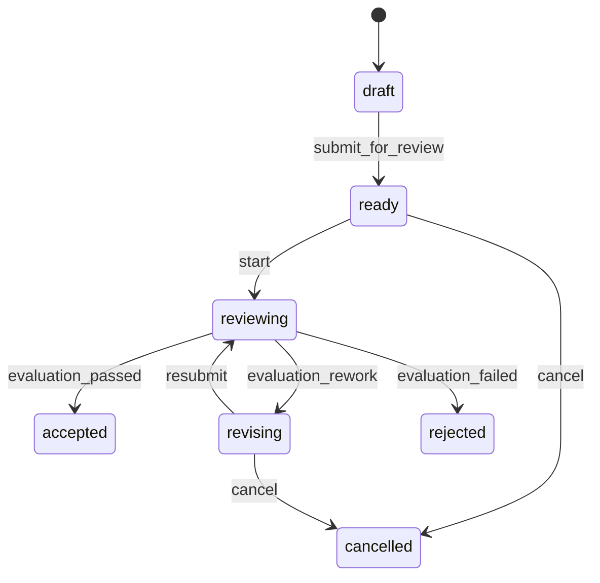

# 08 一致性样例

## 1. 用途

这些样例不是产品行业模板，而是内核 conformance fixtures。实现时把完整 JSON 放入
`backend/tests/fixtures/kernel/`，用它们验证同一内核能处理不同状态、责任和评价路径。

## 2. Fixture A：独立复核

### 2.1 定义

范围：`workspace`。角色：`owner`、`producer`、`reviewer`，其中 producer 与 reviewer 职责分离。

生命周期：



转换表：

| command | from → to | 角色 | guard | effect |
|---|---|---|---|---|
| `submit_for_review` | draft → ready | owner | input artifact exists；slots filled | request_plan |
| `start_work` | ready → reviewing | owner | valid plan；no active run | start_run |
| `complete_work` | reviewing → accepted | service(trigger) | outcome pass | emit completed |
| `request_rework` | reviewing → revising | service(trigger) | outcome rework；attempt < 2 | create rework context |
| `resubmit` | revising → reviewing | producer | revised artifact exists | start_run |
| `fail_work` | reviewing → rejected | service(trigger) | outcome fail | emit failed |
| `cancel_work` | ready/revising → cancelled | owner | no dangerous side effect pending | cancel_run |

execution status 预期：

```text
创建 idle
start_work queued
record_run_started running
record_run_outcome(succeeded/partial/failed/timed_out) evaluating
evaluation pass succeeded
evaluation rework idle
evaluation human_review waiting
evaluation fail failed
```

### 2.2 成功路径

前置：

- bundle v1 固定；
- user U1=owner，agent A1=producer，user U2=reviewer；
- Artifact D1 已存在；
- Plan P1 的生成节点使用 producer，复核节点使用 reviewer。

期望命令/事件：

```text
create_work(v1)
  → work.created(version=1)
assign scope roles owner/producer/reviewer
  → scope.role_assigned/activated ×3
bind owner/producer/reviewer to work slots
  → work.role_bound ×3
submit_for_review(expected=v4)
  → draft→ready + work.plan_requested
record_plan_ready
  → work.plan_ready
start_work
  → ready→reviewing + run queued + execution_requested
record_run_started
  → execution_started
record_run_outcome(succeeded)
  → execution_succeeded + evaluation_requested
record_evaluation(pass)
  → evaluation_completed(pass)
trigger complete_work
  → reviewing→accepted + work.completed
```

断言：

- 每条实际修改 Work 聚合或其受控子对象的成功 WorkCommand version 精确 +1；明确 no_state_change 不增长；
- Plan 不能选择未任职但能力相同的 Agent；
- completed 前必须存在 Evaluation(pass)；
- timeline 能从 U1 的 start 追到 Run、Result、Evaluation 和 trigger command；
- 更晚到达的旧 Run outcome 被标记 stale，不能改变 accepted。

### 2.3 返工路径

第一次 Evaluation 为 rework：

- WorkItem 转 revising，execution_status 回 idle；
- 原 Result/Evaluation 不变；
- rework context 引用原 findings；
- producer 补 D2 后 resubmit；
- 新 Run sequence=2、logical attempt=2；
- 第二次 pass 才 accepted。

第三次 rework 请求超过定义上限，Trigger 必须改发 `request_human_review`，不能继续执行。

### 2.4 人审路径

Evaluation=human_review：

- 创建 required slot=reviewer 的 Approval；
- Run/Workflow 已终态，quality_review 不向 Temporal 发送 signal；Work 进入质量等待；
- U1 owner 但没有 reviewer slot，不能决定；
- U2 决定 approve，审批 fingerprint 与派生的 `complete_work` command 完全匹配并完成工作；
- U2 reject 时 bundle 的 reject_action 发 `request_rework`；进入 idle 后 producer 才能把 D1 改为 D2，旧
  Approval/complete receipt 保持 rejected，不得复活。

## 3. Fixture B：事件触发的子工作

### 3.1 目的

验证外层闭环，不依赖“项目”硬编码：

```text
父工作完成 → DomainEvent → Trigger → 创建子工作 → 子工作独立执行
```

父定义 `core.assessment`，子定义 `core.remediation`。父 scope=`work_group`，子工作复用同 Scope。

父工作 outcome：

- score ≥ 0.8：complete，不建子工作；
- score 0.5–0.8：complete，并建 remediation；
- score < 0.5：human_review；
- 执行错误：fail。

Trigger：

```json
{
  "key": "create_remediation_for_medium_score",
  "on_event": "work.completed",
  "conditions": [
    {
      "op": "all",
      "conditions": [
        {"op": "gte", "path": "/event/payload/score", "value": 0.5},
        {"op": "lt", "path": "/event/payload/score", "value": 0.8}
      ]
    }
  ],
  "emit_command": {
    "command_type": "create_child_work",
    "child_bundle_dependency_key": "remediation_v1",
    "payload_mapping": {
      "op": "object",
      "fields": {
        "source_result_id": {"op": "from", "path": "/event/payload/result_id", "required": true}
      }
    }
  },
  "max_fires_per_correlation": 1
}
```

断言：

- 同一 completed Event 重投 10 次，只创建一个 child；
- child.parent_work_item_id 指向父；
- 父 bundle 的 dependency closure 固定 remediation bundle 1.0，之后发布 2.0 仍创建 1.0 child；
- source_result_id 只引用 Artifact/Result，不复制正文；
- child 创建失败进入 trigger receipt failed/dead letter，父仍保持 completed；
- dependency 缺失时父 bundle 编译失败，不允许带缺陷 bundle 发布；运行数据损坏导致依赖不可读时进入
  dead letter，恢复同一固定依赖后重放原 event，只创建一个 child。

## 4. Fixture C：精确审批与取消竞争

用于并发测试：

1. WorkItem version=7，Run running；
2. actor 请求 `cancel_work`，策略要求审批，生成 Approval A；
3. Run 同时自然完成并先提交 version=8；
4. actor 用 A 再发 cancel，必须得到 `APPROVAL_INVALID` 或 `WORK_VERSION_CONFLICT`；
5. WorkItem 保持由 Evaluation 决定的终态；
6. A 标记 revoked/不可消费；
7. 竞争过程有 audit，但不产生第二个业务终态。

反向顺序：

1. cancel 先持锁并提交 cancelled；
2. 迟到 run outcome 保存诊断/Result，可标 stale；
3. 不得把 WorkItem 从 cancelled 改成 succeeded；
4. Temporal 收到幂等 cancel。

## 5. Fixture D：恢复

按步骤注入故障：

| 注入点 | 预期 |
|---|---|
| `start_work` 提交后、Worker 领取前停止 | queued + pending outbox |
| Temporal start 成功后、Worker 标 published 前停止 | 重启遇 AlreadyStarted，标成功 |
| Result commit 后 Activity 抛超时 | retry 返回同 result_id |
| Evaluation commit 后 record command 前停止 | 对账/worker 补同一 command |
| terminal command commit 后 signal response 丢失 | 重发返回 receipt 原结果 |

每种故障恢复后断言：

- WorkItem 最终状态唯一；
- active Run 唯一；
- ExternalEffectReceipt 只有一个业务键；支持 provider 幂等时 succeeded，不支持且结果歧义时 uncertain 且
  不自动再调用；
- transition version 连续无重复；
- outbox 无永久 processing；
- correlation chain 完整。

## 6. Fixture E：Scope 关系与任职继承

- workspace W 下有 team T1/T2，`serves` 关系从 T1 指向 T2；
- 重复创建同 active relation 返回原 receipt，反向创建是另一条关系；
- 非法 scope type、跨 org、超过 cardinality 均在写入前拒绝；
- W 有 owner assignment A，slot inheritance=nearest，T1 无本地 owner 时 binding 解析 A；
- T1 激活本地 owner B 后只解析 B；B suspend 后回退 A；inheritance=none 时不回退。

## 7. Fixture F：责任与执行委派

- human H 是 accountable ScopeRoleAssignment；review slot 允许 delegation；
- WorkRoleBinding 记录 H，executor=Agent A；Manifest 同时包含 H 的责任与 A 的执行版本；
- 能力相同但未被委派的 Agent B 不可被路由；
- revoke delegation 后新 Run 失败 `ASSIGNMENT_MISSING`，已运行 Run 按固定 Manifest 收尾；
- producer/reviewer 同 actor 的 binding 激活失败。

## 8. Fixture G：审批续接

对 manual 与 automatic 各执行：receipt awaiting → Approval approved → resume → consumed/succeeded。分别在
三个边界杀进程并恢复；每次断言只产生一次业务效果。批准后输入 revision 改变时 resume 返回
`APPROVAL_STALE`，Approval revoked、receipt rejected，不创建替代命令。

## 9. Fixture H：持久调度与事件顺序

- 创建 due_at 已过期的 fire_once 与 skip schedule；重启 scheduler 后前者派发一次、后者取消并记录原因；
- 两个 worker 同时领取只有一个 dispatched receipt；cancel/dispatch 竞争符合先锁先提交；
- 同 WorkItem event version 9 先于 8 到达，consumer 不处理 9；8 到达后依次处理；重复 8/9 无效果。

## 10. Fixture I：输入快照与计划失效

- planning snapshot 固定 input revision 1，Plan 记录同 checksum；
- 重复提交相同输入 no_state_change；提交新 Artifact 后 revision=2、旧 Plan superseded、审批 revoked；
- 迟到的 revision 1 `record_plan_ready` 被拒绝；revision 2 Plan 可启动且 Manifest 引用 execution snapshot。

## 11. Fixture J：渐进模式与解释器兼容

- org 从 legacy → shadow → kernel；切换只影响新 Task/Work/Run，历史 execution_mode 不变；
- shadow 比较不反写 legacy；kernel 回退只停止新 kernel 实例；
- bundle min kernel 高于运行版本时 queued Run 不启动并告警，升级后同一 outbox 幂等启动；
- DB 直接插入跨 org FK、第二个 active Run、NULL 重复评价和重复 system outbox 均失败。

## 12. Fixture K：声明式协议

- RFC 8785 测试向量跨进程 checksum 相同；`-0/NaN/Infinity` 被拒绝；
- `/a~1b/~0c` 正确解析，`$.a`、通配符和数组负下标被拒绝；
- missing 与 null 分离，`exists(null)=true`，字符串 `"1"` 不等于数字 `1`，错误类型比较返回稳定错误；
- MappingExprV1 required source 缺失进入 dead letter，输出未通过 child schema 不创建 WorkItem；
- SchemaProfileV1 未列 keyword、远程/递归 ref 和超限 AST 发布失败。

## 13. Fixture L：Approval 与 Schedule 子聚合

- Definition/Scope/Work 各创建一个 Approval，只有同 family decide 命令可修改；并发决定只有一个 version；
- decide 与 original resume 并发不死锁，目标变化时 revoked/stale；每个 version 至多一个 decision；
- schedule dispatcher 在一个事务 CAS dispatched、创建 receipt/event；注入提交前崩溃后为 pending，提交后
  崩溃重启仍只找到一个 receipt；receipt rejected 后 schedule 仍 dispatched。

## 14. Fixture M：失败评价与两类人审

- succeeded/partial/failed/timed_out 四种 Run outcome 均进入 evaluating 并产生 Evaluation 请求；
- unexpected external cancel 作为 failure_class 进入 Evaluation；已提交 Work cancel 的 cancelled outcome 不反转 Work；
- execution_gate 时 Run/Work waiting、Temporal 收 approved signal；quality_review 时 Workflow terminal，不 signal，
  只续接 complete/rework/fail intent。

## 15. Fixture N：Artifact 与外部调用恢复

- 在 staging、upload、verify、ready+Result 四个边界注入崩溃，重试后只存在一个 ready Artifact/Result；
- checksum 不符转 quarantined，Context 不可读；GC 只删除过期、无引用且 HEAD/checksum 匹配的 orphan；
- provider 有幂等能力时同 key 重试；无能力且调用后超时进入 uncertain，人工对账前不重试。

## 16. Fixture O：容量与治理启动

- max_active=1 并发 20 次 start 只创建一个 held reservation/Run，terminal/cancel/lease recovery 精确释放；
- uninitialized org 只有已有 owner/admin 可创建唯一 org_governance Scope；owner activation 与 pointer/state
  原子提交，后续写需任职；第二 Scope、非法 policy、跨 org pointer 均拒绝；
- DefinitionValidator/Compiler 无 session/commit，publish/compile 绕过 CommandService 的架构测试失败。

## 17. Fixture P：shadow 非阻塞

- legacy Task 事务成功且写 pending link/outbox；注入 materialize 失败，旧 API 响应和页面仍成功；
- worker 重试最终建立唯一 WorkItem/link，shadow timeline/diff 不反写 legacy；
- 切 kernel 仍需所有未允许 mismatch 清零，kernel 创建失败按新用例原子返回失败。

## 18. Fixture Q：治理政策版本固定

- policy revision 1 创建 Approval/Run/Reservation 后，用 update_scope 发布 revision 2；旧对象仍引用 revision 1
  checksum，新命令只使用 revision 2；相同 policy 重提 no-op；
- 删除 pointer、归档治理 Scope或篡改 checksum 的故障注入均 fail closed 并由对账器告警，不读默认政策。

## 19. Fixture R：核心模型兼容所有权

- 从 kernel 与三个旧 models path 分别 import 六个 class，逐一断言 object identity、tablename 与 metadata key；
- Alembic autogenerate 无 rename/drop/create，旧 Repository/API 特征测试不改断言通过；
- 架构扫描发现 kernel import 旧 modules 时立即失败。

## 20. 最小自动化测试文件

必须新增：

```text
backend/tests/
├── test_kernel_definition_schema.py
├── test_kernel_definition_compiler.py
├── test_kernel_declarative_protocol.py
├── test_kernel_state_machine.py
├── test_kernel_policy.py
├── test_kernel_command_idempotency.py
├── test_kernel_command_concurrency.py
├── test_kernel_command_families.py
├── test_kernel_scope_relation_assignment.py
├── test_kernel_work_role_binding.py
├── test_kernel_work_snapshot.py
├── test_kernel_scheduled_command.py
├── test_kernel_event_ordering.py
├── test_kernel_trigger_loop_guard.py
├── test_kernel_approval_fingerprint.py
├── test_kernel_approval_commands.py
├── test_kernel_execution_reservation.py
├── test_kernel_external_effect_receipt.py
├── test_kernel_artifact_commit.py
├── test_kernel_governance_bootstrap.py
├── test_kernel_governance_policy.py
├── test_kernel_model_ownership.py
├── test_kernel_architecture_boundaries.py
├── test_integration_kernel_rls.py
├── test_integration_kernel_api.py
├── test_integration_kernel_outbox.py
├── test_integration_kernel_legacy_adapter.py
├── test_integration_kernel_workflow.py
├── test_integration_kernel_reconciliation.py
└── fixtures/kernel/
    ├── domain_package_v1.json
    ├── role_owner_v1.json
    ├── role_producer_v1.json
    ├── role_reviewer_v1.json
    ├── work_independent_review_v1.json
    ├── work_assessment_v1.json
    └── work_remediation_v1.json
```

Fixture JSON 是测试数据，不由 seed 自动安装到真实组织；平台正式内置定义需另走发布评审。

## 21. 最终验收记录模板

每个 Gate 保存：

```text
Gate:
Commit:
Migration revision:
Feature flags:
Test command and result:
OpenAPI diff:
RLS A/B result:
Temporal replay histories:
Fault injections:
Known debt (linked):
Rollback rehearsal:
Reviewer:
Date:
```

只有证据齐全才能将对应 feature flag 默认开启。
