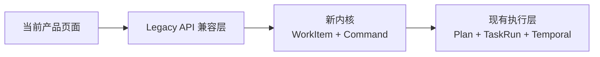

# 09 渐进演化与产品连续性

## 1. 目的

本章集中回答两个问题：

1. 当前 Polis 如何在持续可用的前提下逐步演化到第三轮内核；
2. 内核演化完成后，如何重新梳理对外产品交互，同时保证既有业务、页面和用户操作不中断。

K0 只改变 ORM 代码所有权且必须产生 0 DDL/0 行为差异；本章的页面合同从 K0 起持续生效。K1–K6
是功能发布阶段。任何阶段只要导致当前关键页面不可用、历史数据不可见或
用户无法继续完成原有任务，就不能开启下一阶段功能开关。

## 2. 总体策略：保留下层，包裹中层，补齐上层

当前 Polis 已经具备：

```text
Org / Role / Agent / Skill
→ Task / Plan / TaskRun
→ Temporal / AgentRuntime
→ Result / Approval / Memory / Observability
```

演化过程中：

- 保留 AgentRuntime、Temporal、Skill、Memory、Artifact 和 Observability；
- 用 WorkItem、Command、Policy、StateMachine 包裹 Task/Plan/TaskRun；
- 用 DefinitionBundle、ScopeRoleAssignment 和 WorkRoleBinding 补齐当前缺失的定义与责任语义；
- 通过兼容适配器维持现有 API 和页面；
- 新旧链路并行验证，但任何业务事实只允许一个写入真相源；
- 内核稳定后再设计新的产品交互，不把内核对象原样暴露给普通用户。



迁移期页面可以继续请求旧 API，但旧 API 内部逐步改为调用新内核。前端不需要与后端同时完成一次性
切换。

## 3. 连续性不变量

### C-I01 当前关键操作始终可用

在替代流程达到功能等价前，用户必须仍能：

- 创建和查看公司；
- 创建、查看、运行和再次运行 Task；
- 生成、查看和批准 Plan；
- 查看运行状态、节点结果、日志和成本；
- 完成人审；
- 查看、下载和导出历史结果；
- 查看并处理审批；
- 管理成员、角色、Agent、Skill、模型和设置；
- 使用已有场景模板。

### C-I02 不要求用户重建已有数据

组织、Task、Plan、TaskRun、Agent、Skill、Artifact、Approval 和历史结果必须被迁移或兼容读取。
不得要求用户为了使用新内核重新创建公司、任务、Agent 或上传历史附件。

### C-I03 前端不双写

同一个用户动作只能调用一个写入口。迁移期可以由后端适配器在同一用例内写入兼容数据，前端不得
同时调用旧 API 和新 API，以免产生两个 Task/WorkItem 或两个 Run。

### C-I04 一个阶段只有一个真相源

- K1–K2：旧 Task/Plan/TaskRun 是产品真相，新内核只用于隔离验证；
- K3 shadow：旧 Task 是产品真相，WorkItem 只作异步比较且不反写；切到 kernel 后 WorkItem 才是工作
  状态真相，旧响应由适配器派生；
- Execution 切换前：旧 TaskWorkflow 是执行真相；
- K4 切换后：DB 中 ExecutionRun 是业务真相，Temporal 是编排历史；
- 不允许在没有模式标记的情况下双向同步。

每个 org/WorkItem 保存明确的 `kernel_mode=legacy/shadow/kernel`，不能仅依赖全局开关推断。

### C-I05 每次切换都可由功能开关回退

回退只改变流量入口，不删除新数据、不回写旧历史。已经由新内核创建的运行继续由对应版本收尾；
新请求回到旧入口或停止进入新入口。

### C-I06 新产品页面不早于内核语义稳定

K1–K5 以保证现有页面继续可用为主。只有 Definition、WorkItem、ScopeRoleAssignment、WorkRoleBinding、Evaluation 和
Approval 的语义通过 K5 Gate 后，才正式设计并确认新的产品信息架构。

### C-I07 旧页面不因新页面上线立即删除

新页面必须经历 internal → selected org → canary → default 四级发布。旧页面和深链接至少保留两个
稳定发布周期，并提供回退入口。

### C-I08 用户术语与内部模型解耦

新产品不得直接要求普通用户理解 DefinitionBundle、CommandReceipt、Outbox、Trigger 或
ExecutionRun。页面使用用户熟悉的工作、负责人、进度、结果和待处理事项，内部对象只在高级治理和
诊断中出现。

## 4. 当前页面基线

以下页面是迁移期间必须保护的现有产品合同：

| 当前页面 | 路由 | 当前关键行为 | 迁移期间要求 |
|---|---|---|---|
| 公司列表/开办 | `/dashboard` | 创建、进入和切换公司 | 不改变登录、Org ID 和开办结果 |
| 工作台 | `/orgs/{id}` | 输入目标、待审批、进行中、最近产出、统计 | 旧卡片和链接持续可打开 |
| 工作列表 | `/orgs/{id}/tasks` | 创建、筛选、出图、运行、再次运行、历史、导出、删除 | 全部动作有兼容 API；状态文案不漂移 |
| 计划/运行详情 | `/orgs/{id}/plans` | DAG、批准、运行状态、节点结果、日志、成本、人审 | K4 后从 DB 读总体状态，节点诊断仍可用 |
| 场景库 | `/orgs/{id}/scenarios` | 分类、模板选择与沉淀 | 现有 PlanTemplate 兼容读取 |
| 技能库 | `/orgs/{id}/skills` | Skill 查看、创建、审核和发布 | Skill ID/version 不因内核迁移改变 |
| 花名册 | `/orgs/{id}/roster` | 角色、Agent、成员、模型选择 | 现有 Role/Agent 继续显示；范围任职与工作绑定后置增加 |
| 设置 | `/orgs/{id}/settings` | 公司与治理设置 | Org 和成员权限不变 |

修改这些页面前必须先增加对应 E2E/组件回归，不允许把人工浏览作为唯一验收。

## 5. K0–K6 的产品影响

### K0：仅收口核心 ORM 所有权

产品行为、API、数据库 schema 与 Temporal 均不得变化；planner/observability/memory 的旧 import path
通过 compatibility re-export 保留。任何页面或旧回归差异都判定 K0 失败。

### K1：仅新增定义与 WorkItem 骨架

产品行为：

- 当前页面和导航不变；
- 当前 API 不变；
- Definition 管理暂时只通过内部 API、seed 和测试使用；
- 不向普通用户展示 DomainPackage、Bundle 或 Scope。

发布门：

- 现有前后端测试全部通过；
- 数据库 migration 不改变旧表约束和查询结果；
- 关闭新开关后运行行为与当前版本一致。

### K2：新命令闭环隔离运行

产品行为：

- 继续不改现有页面；
- `/api/v1/work-items` 只供测试、内部工具或明确启用的开发组织；
- Outbox/Trigger 不消费旧 Task 事件；
- 新内核故障不得影响旧 Task 执行 Worker。

发布门：

- 新旧 worker 使用独立 topic/领取条件；
- 新内核关闭时，现有页面的创建、出图、运行和审批正常；
- 新接口的高负载或 poison message 不阻塞旧接口。

### K3：Task 进入 shadow 和适配

先按组织分三种模式：

| 模式 | 读 | 写 | 用户影响 |
|---|---|---|---|
| `legacy` | 旧表 | 旧 service | 完全不变 |
| `shadow` | 旧表 | 旧用例 + 同事务 shadow outbox/pending link，异步生成 WorkItem | 页面不变；只比较数据 |
| `kernel` | WorkItem，经旧响应适配 | Command Handler | 页面不变；内部真相切换 |

模式真相固定为 `org_kernel_setting.kernel_mode`，变更带 config_version 与审计；不得仅靠部署环境变量、
feature flag、link 是否存在或 WorkItem FK 是否为空推断。实例在创建时固化：

- `work_item.kernel_mode=native/legacy_shadow`；
- `task_run.execution_mode=legacy/kernel`；
- `legacy_task_work_link.link_mode=shadow/kernel`。

org 模式切换只影响切换事务提交后创建的新实例。已创建 WorkItem、Plan 和 Run 不原地换 mode；回退到
legacy 也不反写、删除或隐藏已完成的 kernel 历史。

shadow 规则：

- legacy Task 按原事务先提交；同事务写 `kernel.shadow.materialize.v1` outbox 与 pending link；
- WorkItem 物化始终异步且幂等，失败进入重试/修复队列并告警，不改变已经成功的旧请求或页面结果；
- pending/failed link 必须带 last_error_code、attempt 与 updated_at，可由对账器修复；
- shadow 数据只用于比较，不反向更新旧状态；
- 比较 Task 数、状态、最近 Run、权限和历史结果；
- 差异达到 0 或进入明确允许清单后，单个测试 org 才能切 kernel。
- 任一 pending/failed link 直接阻断切 kernel，不能用 mismatch 允许清单绕过缺失物化。

差异记录必须写 `kernel_shadow_comparison(org_id,source_type,source_id,legacy_checksum,kernel_checksum,
status,reason_code,compared_at)`；允许清单必须有 reason、owner、expires_at，过期差异重新阻断切换。

页面验收：

- Task 创建后仍出现在列表；
- 出图后按钮和 pending 状态与当前一致；
- 首次运行、再次运行、历史、导出正常；
- 当前深链接 `/plans?plan={id}` 仍能打开；
- 删除操作在内核中映射为 archive/cancel，但用户看到的列表行为与当前一致；
- API 响应保持旧字段和旧状态枚举。

### K4：执行链切换

切换单位是“新 Run”，不能把运行中的旧 Workflow 强制迁移：

- legacy Run 继续由旧 TaskWorkflow 跑完；
- kernel Run 使用 Outbox + 新/版本化 Workflow；
- Plan/Run 记录明确 `execution_mode`；
- 页面查询适配器同时识别两种 Run；
- 一个 Task 的历史可以包含两种 Run，但排序、导出和查看方式一致。

状态兼容：

| 新 ExecutionRun | 旧页面状态 |
|---|---|
| queued/starting | pending |
| running/waiting | running；人审节点另外显示 waiting_human |
| succeeded | done |
| partial | needs_review |
| failed/timed_out | failed |
| cancelled | paused 或新增兼容文案；不得显示为成功 |

当 Run 已 failed/timed_out 但 Work 仍 evaluating 时，旧页面适配优先返回现有 `running/processing` 兼容态并
附 `evaluation_pending=true`，不得提前宣告业务失败；Evaluation + fail_work 提交后才返回 failed。

发布门：

- Temporal 不可用时，旧页面显示“已排队/编排服务暂不可用”，不能丢失刚创建的工作；
- 工作台“进行中”和“最近产出”与 WorkItem/Run 数据一致；
- 计划详情轮询不会把 terminal Run 显示回 running；
- legacy 与 kernel Run 的导出、结果和观测链接都可用；
- 回退开关只影响新 Run，已开始 Run 由原 workflow 收尾。

### K5：评价和审批闭环切换

产品兼容：

- 现有待审批区域继续读取兼容 ApprovalView；
- `kind/ref_id/payload` 旧字段由适配器提供；
- 新 Approval 的 command fingerprint、TTL 和职责角色不直接暴露为技术字段；
- pass/rework/human_review/fail 映射到现有完成、待返工、待人审、失败文案；
- 原 Plan 页面的人审按钮通过新 Approval decision API 完成，但交互暂时不变。

发布门：

- 工作台待办数量与实际 pending Approval 一致；
- 用户决定后页面能恢复、完成或明确提示重新申请；
- 输入或版本变化导致审批失效时，页面说明原因和下一步；
- 评价服务失败不能把结果显示为已完成；
- 旧 Approval 深链接仍可定位到相关工作/运行。

### K6：稳定化，不删除当前产品

K6 的“清理准备”只停止 legacy-only 写入，不删除当前页面：

- 旧 API 已完全由适配器实现；
- 当前页面仍使用旧响应契约；
- 连续两个稳定发布周期无 legacy-only 数据；
- 当前页面 E2E 全绿；
- 新产品交互方案未验收前，不删除 Task/Plan 页面；
- 即使开始新产品设计，旧页面仍作为回退壳存在。

## 6. 每阶段发布流程

```text
本地与集成测试
→ migration staging 演练
→ 当前页面 E2E
→ shadow 数据比较
→ internal org
→ selected test org
→ 观察指标与人工验收
→ 扩大比例
→ 默认开启
```

任一阶段出现以下情况立即停止扩量：

- Task/Run/Approval 数量差异；
- 页面关键操作失败率上升；
- 状态长时间不收敛；
- 历史结果或附件不可访问；
- 权限扩大或缩小错误；
- 旧深链接失效；
- 需要人工改数据库才能继续。

回退步骤：

1. 关闭对应 org 的新入口开关；
2. 停止创建新的 kernel Run；
3. 允许已开始的 Workflow 按其版本收尾；
4. 保留新数据并运行对账，不做反向破坏性迁移；
5. 页面继续通过兼容 API 读取 legacy + kernel 历史；
6. 修复后从 internal org 重新开始扩量。

## 7. 产品连续性测试

在现有测试外，新增一组“当前产品合同测试”：

```text
frontend/e2e/
├── current-org-provision.spec.ts
├── current-workbench.spec.ts
├── current-task-lifecycle.spec.ts
├── current-plan-run.spec.ts
├── current-human-approval.spec.ts
├── current-result-export.spec.ts
├── current-scenario.spec.ts
├── current-roster.spec.ts
└── current-skill-governance.spec.ts
```

每套生命周期测试至少在两种后端模式运行：

```text
KERNEL_MODE=legacy
KERNEL_MODE=kernel
```

shadow 模式另做数据比较，不作为用户行为模式。测试必须覆盖刷新页面、重新登录、直接打开旧深链接和
执行过程中切换页面。

模式测试必须通过 application 管理用例改变 `org_kernel_setting`，不得在测试进程中用单一
`KERNEL_MODE` 环境变量替代多 org 持久配置。环境变量只允许控制“某阶段代码是否部署启用”的平台总开关。

## 8. 内核完成后的产品交互重构

这是一个必须执行的后续阶段，暂定为 `PX`，不属于 K0–K6 内核实现，不得在内核尚不稳定时提前定稿。

### PX0：保留现状基线

现在就保存：

- 当前导航与全部页面清单；
- 每页用户目标和关键动作；
- 当前 API 与状态文案；
- 典型任务从创建到结果的录像或 E2E；
- 当前可用性问题和用户反馈。

这些材料用于判断新产品是否真正改善，而不是只更换术语。

### PX1：内核能力转译为业务语言

K5 Gate 后，对下列内部概念确定用户表达：

| 内部概念 | 产品层需要回答 |
|---|---|
| Scope | 用户理解的企业、业务单元、项目或其他范围是什么 |
| WorkDefinition | 用户选择的是场景、流程、工作类型还是系统自动识别 |
| WorkItem | 用户主要管理的“工作”到底以何种业务对象呈现 |
| ScopeRoleAssignment / WorkRoleBinding | 页面如何表达负责人、参与者、人机协作、临时任职与执行委派 |
| lifecycle/execution 双状态 | 如何合并成用户能行动的状态和待办 |
| Approval | 用户需要看到哪些风险、依据和影响 |
| Evaluation | 如何呈现结果是否合格、返工原因和证据 |
| Artifact/Result | 交付物、附件、结果与历史如何组织 |

此阶段只做语义映射，不直接改页面。

### PX2：重新梳理用户故事和信息架构

必须重新回答：

- 不同目标用户从哪里进入系统；
- 用户的主要对象是工作、项目、业务线还是结果；
- 哪些动作由用户主动发起，哪些由事件自动产生；
- 待办、运行中、风险、审批和结果如何统一；
- 角色和 Agent 哪些对普通用户可见；
- 技术信息在哪个高级视图出现；
- 现有 Task、Plan、场景、花名册页面哪些保留、合并或降级。

输出物至少包括：

- 目标用户与核心任务；
- 当前流程和目标流程对照；
- 新信息架构；
- 页面清单；
- 关键页面状态矩阵；
- 端到端可点击原型；
- 与当前页面的迁移映射；
- 可用性测试结论。

该阶段需要用户单独确认，不能由内核设计自动推导。

### PX3：建立产品适配 API

新页面不直接拼装十几个内核端点。根据确认后的产品流程增加稳定的 product/BFF query：

- 工作台聚合；
- 用户待办；
- 工作列表和业务状态；
- 工作详情 timeline；
- 责任人与执行者摘要；
- 结果和交付物；
- 风险与审批摘要。

Command 仍进入同一个 KernelCommandService。BFF 只聚合读取和翻译产品语义，不复制状态机。

### PX4：双产品壳灰度

```text
现有壳 /orgs/{id}/...
新壳   /orgs/{id}/... 或独立 preview 路径
             ↓
       同一个内核和数据
```

要求：

- 新旧页面读取相同 WorkItem/Run 真相；
- 不允许新旧页面各有一套业务状态；
- 新页面操作后旧页面能看到一致结果，反之亦然；
- 先按用户/org 开关灰度；
- 保留“返回经典版”；
- 旧书签和外部链接重定向或继续有效。

### PX5：产品切换

只有同时满足以下条件，才能把新产品设为默认：

- 核心用户任务完成率不低于当前版本；
- 创建到结果的成功率、耗时和错误率不退化；
- 关键页面无阻断级可用性问题；
- 当前页面所有关键动作有去向；
- 权限、审批、历史、导出和深链接迁移完成；
- selected org 连续两个发布周期稳定；
- 回退开关经过演练；
- 用户确认产品术语和流程可理解。

旧产品下线需要单独 ADR，不包含在内核 K6 的清理范围。

## 9. 当前页面到未来产品的初步关系

以下仅是后续梳理的输入，不是已经确定的新产品方案：

| 当前页面 | 可能保留的价值 | 后续重点评估 |
|---|---|---|
| 工作台 | 待办、进行中、最近结果 | 是否成为统一行动入口 |
| 工作列表 | 工作主入口和历史 | 是否按 Scope/工作类型组织，而非只列 Task |
| Plan 详情 | 执行图、日志、成本 | 是否降为高级运行详情，而非主要业务页面 |
| 场景库 | 可复用工作入口 | 是否由 WorkDefinition/领域包提供但用业务语言呈现 |
| 花名册 | 人、Agent 和角色 | 如何突出责任任职而不是 Agent 配置 |
| 技能库 | 执行能力资产 | 是否仅对管理员和高级用户展示 |
| 设置 | 组织与治理 | 如何承载自治、审批、预算和数据边界 |

这张表不能直接作为 UI 开发依据。PX2 完成并经用户确认后，另建产品交互设计文档。

## 10. 完成标准

“渐进演化完成”与“新产品完成”是两个不同 Gate：

### Kernel Evolution Complete

- K0–K6 全部验收；
- 当前产品页面在 kernel mode 下关键 E2E 全部通过；
- 所有新工作由 WorkItem/Command 驱动；
- legacy-only 写入为 0；
- 历史 Task/Run/Result 可继续读取；
- 回退演练通过。

### Product Interaction Complete

- PX1–PX5 完成；
- 新产品流程通过用户确认和可用性测试；
- 新旧页面数据与权限一致；
- 业务指标不退化；
- 旧产品下线 ADR 已单独接受。

前一个 Gate 不自动触发旧页面下线；后一个 Gate 才能决定产品默认入口变化。
